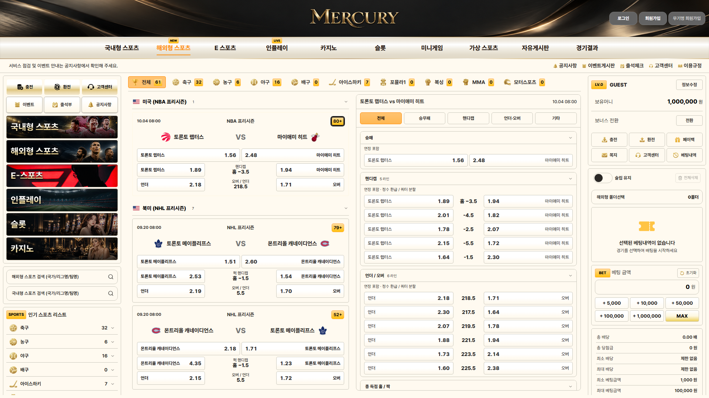
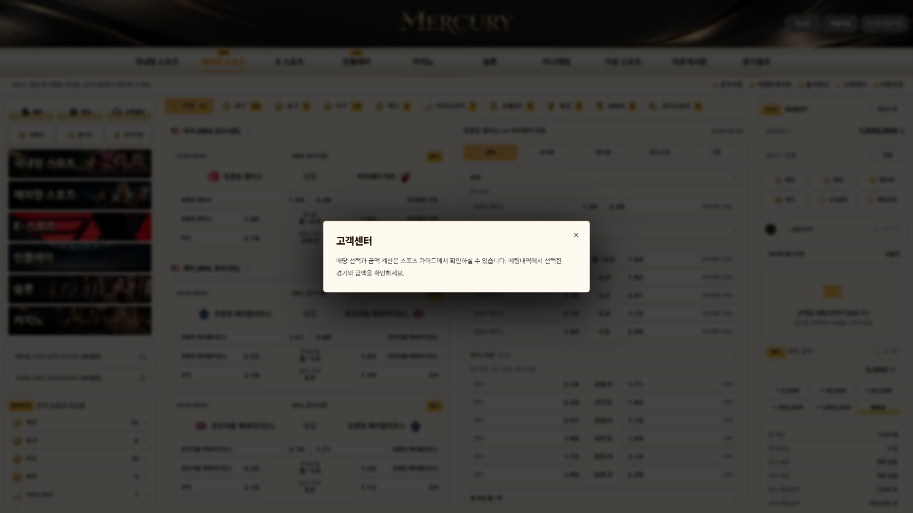
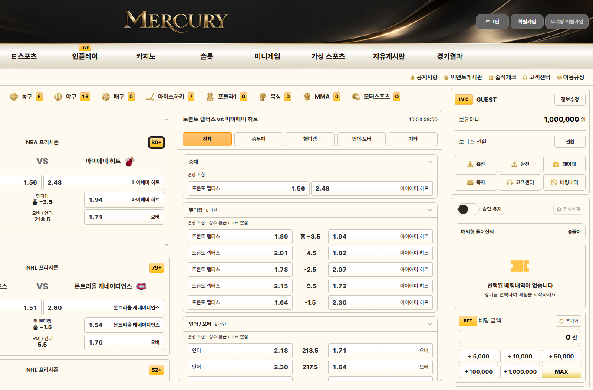

# MERCURY White 독립 QA

**판정: UI 65 PASS / 0 FAIL, 소스·보존 11 PASS / 0 FAIL. 기능·테마 결함 없음. 비차단 접근성 관찰 1건(P4).** 구현자의 자체 검사 건수는 포함하지 않았습니다. 앱 코드는 수정하지 않았습니다.

고정 커밋은 `f9e5847acccbe6bd2790abab9b448d15494ffe17`, URL은 `http://127.0.0.1:5418/`입니다. Windows·Node 24.14·설치된 Playwright Chromium의 새 비영구 headless 컨텍스트로 검사했습니다. Browser plugin은 제공되지 않았고 사용자 지시대로 기존 외부 Playwright를 사용했습니다. 사용자 GUI·브라우저·프로필·저장소·IAB를 사용하지 않았습니다. 새 기록은 `qa-results/independent-20261007-0750/`에만 작성했습니다. 서버 시작·종료, 실제 충전·환전·베팅 확정, 원격 전송·배포는 하지 않았습니다.

## 승인 입력과 고정본

- 입력 `input/mercury-palette_98.json`은 **v6·3132바이트·39역할**, SHA-256 `f8387c05ce6298592b1eca859f41dd1d4069a4a95ab9d7631fac9b4badc81ae5`입니다. 소비 사본과 Git 바이트까지 동일합니다.
- 이전 c5의 순수 테마 계산 코드에 승인 JSON을 넣어 계산한 전체 스냅샷·CSS가 새 컴파일러와 정확히 같습니다. 색상·잠금·mood·chip/menu/button/odds 모드와 PNG tuning을 임의 변경하지 않았습니다. 실제 페이지의 **203개 유효 CSS 변수**도 CSS 파서로 정규화하여 비교했고 모두 일치합니다.
- 정적 테마 CSS SHA-256: `d5ebac3f881a9762beac4ce4764d019bfeb42d6dcef62ba3d958442771e2d333`.
- page SHA-256: `62ea9f6a088824374d196f838efedd2c87dacccfb869de622b6b68c0f47b7413`.
- 검사 전후 **342개 소스·292개 빌드 산출물**이 구현자가 고정한 해시와 동일했습니다. 최종 HEAD도 동일하고 작업 트리는 깨끗합니다. 전체 실제 SHA와 검사 시각은 [final-source.json](final-source.json), 시작/종료는 [source-start.json](source-start.json)·[source-end.json](source-end.json)에 있습니다.

## 화면·상태·동작 확인

| 검증 범위 | 결과 |
| --- | --- |
| 식별·첫 진입 | 정확한 URL/화이트 제목, 실제 경기 화면과 이미지 로드. 프레임워크 오류 오버레이 없음 |
| 편집 기능 제거 | 편집기·피커·QA UI·전용 입력·빈 편집 lane 없음. 앱 import와 프로덕션 번들에서도 편집/프리셋/이력 표식 없음 |
| 초기 테마 | 저장값 없는 첫 화면과 JavaScript 비활성화 첫 렌더에서 같은 승인 테마. 화이트 바탕·검정 리그·오렌지 칩 적용 |
| 역할·효과 | 실제 배경/패널/입력/본문/배당 색상, 전체 역할 변수, 39색·잠금과 설정 일치. 비활성 모드의 설정은 원래 테마 엔진의 의미 그대로 유지 |
| 칩·메뉴 | 전체 배지·메뉴·마켓 개수·일반/선택 종목 개수에 승인 두 색 그라데이션. 활성 메뉴는 단색 `#ff8f0f`와 같은 색 밑줄. 칩 hover/focus에서 독립 배경·글자·테두리 유지 |
| 선택·hover·focus | 헤더 기본/hover, 선택·일반 종목, 리그, 칩, 선택 배당·마켓의 정상/hover/키보드 focus 상태 확인. 배당/마켓은 승인 warm 그라데이션과 `#ff8800` 테두리 유지 |
| PNG·보호 이미지 | 종목 `93/92/105`, 선택 종목 `97/120/112`, 서비스 `90/101/104`의 실제 CSS 필터 확인. 사진·국기·브랜드·팀 로고의 요소 및 조상에 전역 필터 없음. 일반 실행의 렌더 이미지 모두 로드 |
| 배치·가로 접근 | 1920px 사이트 폭, 2560px에서 x=320, 2306px에서 x=193. 1366px에서는 scrollX=554로 오른쪽 계정·슬립 접근 가능. 경기 목록 스크롤과 페이지/레일이 독립 |
| 필터·리그·마켓 | 전체61경기↔축구32경기, 토론토 검색1경기, 0경기 종목 빈 상태, 리그 접기/펼치기, 세부 마켓 선택 정상 |
| 슬립 | 배당 선택/해제·동일 경기 선택 교체·선택 삭제·전체삭제, 5000×1.56=7800 계산, 잘못된 금액의 오류색/안내, 슬립 유지와 새로고침 복원, Space 키 토글 정상. 제출 버튼을 실행하지 않음 |
| 팝업 | 고객센터·충전 정보·환전 안내·베팅내역·이벤트게시판을 열고 닫음. 팝업이 body portal에 있어도 승인 화이트 바탕 적용. 닫기 hover/키보드 focus 정상. 실행/확정 버튼은 클릭하지 않음 |
| 이전 편집 저장값 | 새 컨텍스트에 의도적으로 어두운 편집 팔레트와 이전 프리셋 키를 주입. 화면은 계속 승인 테마이고 원문은 보존됨. 첫 진입에 편집 키 읽기/쓰기도 없음 |
| 런타임·거래 | 앱 예외0, 일반 실행의 실패한 로컬 요청0, GET/HEAD 외 요청0. 잔액1,000,000원·내역0 유지 |

원시 결과는 [ui-results.json](ui-results.json)·[ui-tail-results.json](ui-tail-results.json)·[ui-tail-2-results.json](ui-tail-2-results.json), 계산 기준은 [expected-theme.json](expected-theme.json), 소스 결과는 [source-results.json](source-results.json)입니다. [summary.json](summary.json)은 중복 검사를 합치고 아래 검수 코드 오류를 분리한 최종 집계입니다.

## 비차단 관찰

**WHITE-A11Y-01 / P4:** 슬립 유지 스위치의 접근성 이름이 `슬립 유지 슬립 유지`로 반복됩니다. 새 컨텍스트에서 `.mc-slip-toggle.ariaSnapshot()`으로 재현했습니다. 스크린리더가 글자를 두 번 읽을 수 있습니다. 마우스·Space 키·포커스 표시·유지/복원은 정상입니다.

해당 native label과 Switch 코드는 c5에서 바이트가 유지된 기존 항목입니다. 이전 5417의 실제 브라우저를 열어 동일 증상을 재검증한 것은 아니므로 **보존된 기존 코드의 관찰**로 분류합니다. 이번 화이트 기능의 차단 결함으로 집계하지 않았고 수정은 하지 않았습니다. 근거는 [observations.json](observations.json)과 `ui-tail-2-results.json`의 실제 switch DOM입니다.

## 보존·검수 코드 오류

공개 자산 **249개**의 원래 바이트가 모두 같고, 기존 편집기 **340개** 및 원본 사이트 **337개** 파일·HEAD도 검사 전후 그대로입니다. 업무 DOM·데이터·폰트·lockfile 등 미변경 파일 **332개**를 비교했습니다. 스포츠 CSS의 CRLF 변환은 실제 계산 내용이 동일하며 공개 이미지 바이트 변경은 없습니다. 보존 비교는 읽기만 수행했습니다.

검수 원시 기록의 실패는 앱 결함과 구분했습니다. Git rename의 목적지만 반환하는 목록 때문에 의도적으로 이동한 이전 컴파일러를 미변경 파일로 분류한 오류, 빈 상태 영역을 정확히 1개로 가정한 오류, switch의 실제 중복 접근성 이름과 다른 exact locator, 목록/세부 화면에 동시에 표시되는 배당 ID에 strict 단일 locator를 사용한 오류입니다. 해당 조건만 바로잡고 영향을 받은 구간을 재검사해 통과했습니다. 첫 결과는 삭제하지 않았으며 [source-adjudication.json](source-adjudication.json)과 [summary.json](summary.json)에 판정 이유를 남겼습니다.

## 실행 유지·미검증

최종 **2026-10-07 08:01:37 UTC**에 5418·5417 모두 HTTP200을 확인했습니다. 화이트 PID **17860**, 시작 **07:31:12.4502042 UTC**와 기존 편집기 PID **35992**, 시작 **03:54:38.7783288 UTC**가 그대로입니다. 서버를 종료하거나 재시작하지 않았습니다.

독립 `node node_modules/typescript/bin/tsc --noEmit --incremental false`는 종료 코드0입니다. 충돌 방지를 위해 production build를 다시 실행하지 않았고 독립 lint도 미실행입니다. 첨부 PNG는 구현 인계에 Library 404로 픽셀 미확보가 명시돼 있으며, 이 검수에서도 픽셀을 보지 못했습니다. 따라서 첨부/원본 화면과의 픽셀 일치를 주장하지 않습니다. 사용한 기준은 승인 JSON과 c5 순수 테마 계산 코드입니다. 실제 금융/베팅 확정, Firefox/Safari·터치 기기는 미실행입니다. 기존 Typekit3종은 환경 네트워크 제한으로 차단돼 대체 글꼴 화면에서 검사했습니다. JavaScript 비활성화 컨텍스트의 의도적인 CSP 차단은 일반 실행 로컬 오류와 분리했습니다.

## 화면 근거

