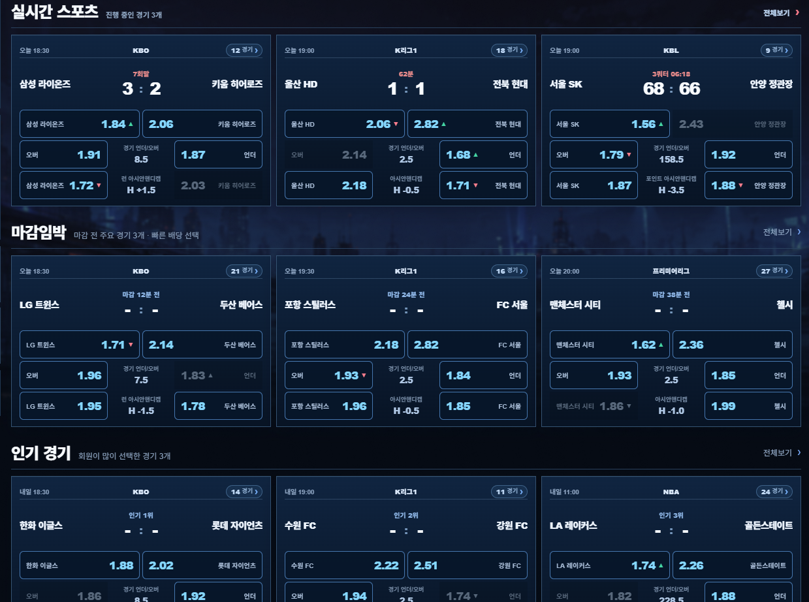

# MERCURY — 화면 디자인 및 MVP 사양

문서 세트: MVP R5 · 2026-09-16  
목표: 지정 폰트·제공 브랜드 이미지·실제 경기와 스포츠 자산으로 완성도를 높인 정밀한 스포츠 데모 한 페이지.

## 0. 사양의 상태와 사용법

- **LOCKED:** 사용자가 확정한 제품 범위·방향·금지사항. 임의 변경하지 않는다.
- **PROPOSED:** 바로 구현해 검수할 수 있도록 구체화한 초기안. 사용자가 승인한 수치나 시안이 아니다. 실제 화면에서 더 나은 안이 확인되면 담당자가 이유와 함께 이 문서에서 조정한다.
- **UNVERIFIED:** 이번 문서 작성에서 직접 확인하지 못한 구현 정보. 확인한 것처럼 채우지 않는다.
- 아래 섹션별 치수·HEX·효과 시간·기본 데이터 수는 별도 표기가 없으면 **PROPOSED**다. LOCKED인 것은 수치의 존재가 아니라 사용자가 확정한 방향이다.
- 현재 MERCURY 외형은 반려됐으며, 전체 UI 시안은 미승인이다. 제공 레터링·엠블럼의 사용과 폰트 역할은 사용자 확정이다. 문서만으로 디자인 완료를 선언하지 않는다.

## 1. MVP와 참고 기준

### MVP — LOCKED

방문자가 스포츠 경기와 배당을 살펴보고, 선택·슬립·금액·계정 상태를 가상으로 조작하면서 디자인과 제작 수준을 판단하는 단일 페이지다.
1920 데스크톱 화면과 실시간 스포츠를 중심으로 한다. 별도 랜딩 페이지, 모바일 UI, 히어로, 중앙 콘텐츠 바로가기, 카지노/슬롯 갤러리는 만들지 않는다.
상단의 다른 카테고리는 기존 메뉴로 유지하되 새 페이지로 확장하지 않는다. 미제공 메뉴는 같은 페이지의 짧은 안내로 처리한다.
실제 베팅·입출금·인증은 연결하지 않는다. 실제 경기 자료를 수집·파싱해 적용하는 것은 허용하며, 지속적인 실시간 피드 운영은 필수가 아니다. 정적 스냅샷과 데모 배당으로 조작을 완성할 수 있다.

완성에는 다음 세 가지가 모두 필요하다.

1. **구성:** 고정 화면, 영역별 스크롤, 채워진 경기 목록, 좌우 서비스/슬립.
2. **조작:** 선택·해제·교체·계산·검색·필터·가상 계정 상태가 실제로 반응.
3. **시각:** 팔레트, 탭, 제목판, 카드, 버튼, 프레임, 효과가 사용자 목표 품질에 도달.

### 함께 제공하는 시각 자료

아래 references 자료는 사용자가 제공한 원본의 파일명만 정리한 것이다. 사이트용 자산은 §12의 assets/branding 및 외부 스포츠 수집 자료로 구분한다. 이번 문서 작업에서 새 이미지를 생성하거나 원본을 가공하지 않았다.

| 자료 | 용도 | 가져오지 않을 요소 |
| --- | --- | --- |
| [WOG 사용자 제공 캡처](references/WOG_reference.png) | 보조 참고. 실제 품질 감사는 지정 사이트를 직접 열어 수행 | 캡처만으로 현재 사이트의 효과를 검증했다고 주장하거나 외형 복제 |
| [COBALT 경기 목록](references/COBALT_cards_reference.png) | 3열 경기 목록과 세 분류의 정보 구성 | 기존의 낮은 마감 품질 |
| [MERCURY 반려 전체 화면](references/MERCURY_rejected_overview.png) | 큰 화면에서 중앙 확장, 갈색 면적, 같은 패널 패턴, 빈 목록과 노출 스크롤바 | 이 외형을 승인 기준으로 사용 |
| [MERCURY 반려 호버](references/MERCURY_rejected_hover.png) | 카드 구조 및 넓은 대각선 그라데이션이 반려됐음을 확인 | 같은 효과의 강도만 높인 재사용 |



**품질 하한점: [WOG](https://wog-1000.com/).** 감사 스레드가 사이트를 직접 보고 버튼·패널·호버 등 전체 완성도를 판단한다. 사이트 내용을 이 문서에 재서술하거나 WOG의 디자인을 복제하지 않는다. MERCURY 사양 준수와 WOG 대비 최소 완성도는 별도 판정한다.

추가 참고: [현재 MERCURY](https://mercury.kexxadrix.chatgpt.site/), [COBALT](https://titan-solution-t03.pages.dev/), [CAT VILLAGE](https://titan-solution-t01.pages.dev/).
완성된 카지노 데모는 마감 수준 참고이며 스포츠 구조를 대신하지 않는다. HADES는 Sites로 동적 구현을 했던 사례다.
과거 타이탄 제작 이력의 대표 프레임·전환 설명·주석·리소스 전달 방식도 참고한다. 해당 스레드 전체 원문을 확인했다는 뜻은 아니다.
자료가 열리지 않으면 확인한 자료와 빠진 자료를 보고한다. 실제로 보지 않은 자료를 검수 근거로 적지 않는다.

## 2. Global

### 2.1 화면과 스크롤 — 방향 LOCKED / 세부 치수 PROPOSED

- 기준은 **1920×1080 모니터에서 일반 브라우저를 최대화한 화면**이다. 1080px을 웹 콘텐츠 높이로 고정하지 않는다. 실제 `innerHeight`를 사용한다.
- 1920에서 현재 표시가 정상이라는 사용자 확인을 존중한다. 미지원 작은 검수 브라우저에 맞추려고 레이아웃을 바꾸지 않는다.
- 콘텐츠 셸은 `box-sizing: border-box; width: 1920px; flex: none`인 고정 폭으로 시작한다. 1920을 넘을 때도 내부 치수는 유지한다. 더 넓은 화면에서는 셸을 가로 중앙에 두고 남는 바깥 영역을 블랙으로 처리하는 안을 사용한다.
- 셸의 폭을 `100vw`, `width:100%` 또는 제한 없는 가변 중앙 칼럼으로 만들지 않는다. 고정 셸 내부의 남은 공간 계산은 가능하다.
- 헤더는 유지하고 좌측·중앙·우측 본문은 각각 세로 스크롤한다. 본문 페이지 전체를 다시 스크롤시키지 않는다.
- 각 스크롤 영역에 `min-height:0`, `overflow-y:auto`를 적용할 수 있다. 트랙·손잡이·화살표 등 **스크롤바 표시는 숨긴다**. 휠·트랙패드·키보드 이동은 유지한다. 끝에서 다른 열로 움직임이 넘어가지 않게 한다.
- 운영 화면에 개발용 크기 슬라이더, 해상도 버튼, 효과 강도 조절기를 넣지 않는다.

| 요소 | 실행 제안 |
| --- | --- |
| 헤더 / 공지 줄 | 68px / 32px |
| 본문 상·하 여백 | 각 12px |
| 셸 좌우 여백 | 각 12px |
| 좌측 / 우측 | 272px / 320px |
| 칼럼 사이 | 각 12px |
| 중앙 | 1280px |
| 중앙 카드 열 간격 | 12px |
| 카드 폭 | (1280 − 12×2) ÷ 3 = 418.67px |

계산: 중앙 = 1920 − 12×2 − 272 − 320 − 12×2 = 1280px.
예시로 콘텐츠 높이 940px이면 본문 가용 높이 = 940 − 68 − 32 − 12×2 = 816px. **940px은 검수용 제안값이며 사용자 브라우저의 실측값이 아니다.**
고정 폭을 유지하는지 확인하기 위한 2560 폭 검수는 반응형 디자인 추가가 아니다.

### 2.2 컬러 역할 — LOCKED

배경의 깊은 블랙, 조금 밝은 패널, 중요한 지점의 선명한 골드, 보조 칩의 아이보리가 각각 보여야 한다.
갈색이나 황동색으로 전체 표면을 채우지 않는다. 골드 광원이 주변 블랙까지 지속적으로 누렇게 물들이지 않게 한다.

아래 토큰은 **PROPOSED**이며 최종 승인값이 아니다.

| 역할 | 초기 값 / 적용 |
| --- | --- |
| 전체 바탕 | `#040506` |
| 프레임·헤더 기본 면 | `#0B0D10` |
| 카드·패널 기본 면 | `#12151A` |
| 돌출된 내부 면 | `#1B2027` |
| 중립 경계 / 상단 반사선 | `#343B46` / `#58616D`의 낮은 투명도 |
| 골드 기본 / 강한 하이라이트 | `#E7B544` / `#FFE2A0` |
| 골드 음영 | `#80551C` — 버튼 베벨·얇은 경계에 한정 |
| 아이보리 칩 면 / 칩 문자 | `#F6F0E2` / `#14171C` |
| 주요 문자 / 보조 문자 | `#F3F0E8` / `#B8BEC7` |
| 사용불가 | 중립 회색 계열, 잠금 아이콘 병행 |

아이보리는 문자색에만 숨기지 않는다. LIVE 등 실제 칩의 밝은 면으로 존재감을 만든다.
본문 데이터는 충분히 읽히게 하고, 골드 문자·선·빛이 한 화면의 모든 정보를 같은 강도로 강조하지 않게 한다.
별도 원색 신호색은 지금 임의 추가하지 않는다. 배당 상승/하락은 우선 ▲/▼ 및 접근 가능한 설명으로 구분한다.

### 2.3 폰트 — 역할 LOCKED / 실제 적용 UNVERIFIED

사용자가 초기에 설정한 시스템 폰트 기준이다. [제공된 설정 화면](references/font-preset.png)을 함께 확인한다.

| 역할 | 지정 폰트 | 적용 원칙 |
| --- | --- | --- |
| 기본 UI | Pretendard JP | 한국어 UI, 메뉴, 팀명, 일반 정보와 조작 문구 |
| 일본어 | Heisei Mincho Std | 일본어가 실제 표시되는 해당 텍스트 |
| 필요한 강조 영역 | Omnigothic | 선택한 제목·강조 부분. 모든 텍스트에 확장하지 않음 |
| 스코어 | DIN Condensed | 경기 점수. 배당·잔액 전체에 자동 확장하지 않음 |

- 기존 프로젝트/시스템의 폰트 파일, 실제 family 별칭, 등록 방식, 지원 weight·glyph, 네트워크 로딩과 최종 렌더링을 확인한다. 현재 문서에 임의 경로나 @font-face 별칭을 만들어 확정하지 않는다.
- 설정 화면은 폰트 파일이 아니다. 파일을 못 찾거나 글리프가 fallback이면 해당 역할을 미확인/미적용으로 보고하고 기존 리소스를 확보한다. 임의 대체한 상태를 완료로 처리하지 않는다.
- 헤더의 MERCURY 레터링은 §12의 제공 이미지를 사용한다. 시스템 폰트나 임시 serif 로고로 재현하지 않는다.
- 실제 폰트 적용 후 글자 폭·행간·말줄임·점수 정렬을 다시 확인한다. 폰트 적용을 이유로 고정 레이아웃을 임의 확대하지 않는다.

### 2.4 타이포그래피 치수·간격·형상 — PROPOSED

- UI 본문/메뉴 14px, 팀명 16px/20px, 제목 20px/24px, 배당 18px/22px, 점수 30px/32px부터 검토한다. 보조 메타데이터는 12px 이상에서 검토한다.
- 숫자는 tabular-nums 지원 여부와 실제 정렬을 확인한다. 스코어는 지정 DIN Condensed에서 검수한다.
- 기본 간격은 4/8/12/16px. 모서리는 버튼 3px, 카드 4px, 사이드 외곽 6px를 시작값으로 한다.
- 헤더 탭·제목 명패는 얕은 절삭 모서리를 사용할 수 있다. 기본 그림자는 검정 음영과 얇은 상단 반사선, 강한 골드 빛은 선택·호버·주요 경계에 집중한다.
- 기본 컴포넌트 외형·뜻 없는 원형 아이콘을 방치하지 않는다. 키보드 포커스는 의도적으로 보이게 설계한다.

## 3. Header

### 고정 내용 — LOCKED

MERCURY 브랜드, 기존 주요 카테고리, 로그인/회원가입 동작. 실시간 스포츠가 기본 활성이다. 다른 카테고리의 페이지를 추가하지 않는다.
헤더 레터링은 제공된 [MERCURY 원본](assets/branding/mercury-wordmark.png)으로 교체한다. 원본의 형상·색·투명도·비율을 보존한다. 기존 문자 로고는 승인 외형이 아니다. 표시 슬롯의 세부 크기는 제안 후 검수한다.

### 실행안 — PROPOSED

- 거의 블랙인 단단한 상단 바. 로고·내비게이션·계정 버튼의 기준선을 정렬한다.
- 하단에는 **폭 전체로 연결되는 2px 골드 레일**을 두고, 레일 아래 8~14px 범위의 부드러운 골드 빛으로 깊이를 준다. 선의 시작/끝을 이유 없이 끊거나 짧은 굵은 조각으로 대체하지 않는다.
- 기본 탭: 중립의 밝은 문자와 블랙 면. 활성 탭: 골드 문자, 짧은 금속 명패 같은 면, 명확한 하단 골드 경계. 주변 탭과 같은 평평한 텍스트로 끝내지 않는다.
- 호버는 탭의 경계·밑면 광택·문자에 작동한다. 메뉴 폭과 주변 정렬은 유지한다. 세부 동작은 Interaction H01을 따른다.
- 회원가입은 골드 버튼, 로그인은 중립 금속 버튼으로 기능 위계를 나눈다.
- 공지 줄은 32px 안에 실제 이용 문구와 간결한 데모 안내를 담는다. 화면 전역에 ‘가상 경기’, ‘디자인 데모’ 문구를 반복하지 않는다. 실제 거래가 없다는 안내는 한 곳에 분명하게 유지한다.

## 4. Left Panel

272px 제안 폭 안에서 서비스·검색/종목·홍보/가이드를 구성하고, 제공된 [엠블럼](assets/branding/mercury-emblem.png)을 좌측에 배치한다. 엠블럼의 정확한 위치와 슬롯은 미확정이므로 서비스 접근성과 첫 화면 밀도를 함께 보고 정한다. 원본 크기에 맞춰 사이드 폭을 키우지 않는다. 중앙 경기 카드와 동일한 패턴으로 모든 패널을 만들지 않는다.

### 빠른 서비스 — PROPOSED

- 별도의 금속 프레임과 돌출된 버튼 면을 가진 서비스 모듈로 만든다. 제목·작은 아이보리 분류 칩·버튼의 층을 구분한다.
- 충전/환전은 2열, 아래 고객센터는 전체 폭. 버튼 높이는 60px/40px부터 검토한다.
- 충전은 밝은 골드 면과 어두운 문자/아이콘, 환전은 차콜 금속 면과 골드 경계로 구분한다. 두 버튼 모두 윗면·측면·눌림 깊이가 읽히게 한다.
- 충전·환전·고객센터·전체 스포츠 등의 표현은 충분한 품질을 낼 수 있는 CSS/벡터로 구현한다. 품질이 부족하면 §12의 규격으로 사용자 이미지 제작을 요청한다. 축소된 기본 아이콘만 얹어 완료 처리하지 않는다.

### 검색·종목 — PROPOSED

- 검색 높이 40px, 종목 행 높이 42px부터 검토한다. 입력·포커스가 명확한 오목한 검색 면을 만든다.
- 수집 루트에서 종목 아이콘 확보 여부를 확인하고 준비된 이미지를 적극 사용한다. 종목에 맞는 이미지를 고정 슬롯에 넣으며 같은 원형/점으로 통일하지 않는다. 미수집 자산은 누락을 보고하고 임시 표시를 최종 디자인으로 승인하지 않는다.
- active 행은 블랙/차콜 면 위에 좌측 골드 레일과 밝은 문자로 표시한다. count는 작은 아이보리 칩으로 분리한다.
- hover와 active를 구분한다. hover가 active 행의 골드 강도를 그대로 복제하지 않게 한다.
- 검색과 종목 필터는 적용한 실제 경기 스냅샷 목록에 작동한다. 결과 수는 데이터에서 계산한다.

### 홍보·가이드 — PROPOSED

- 짧은 제목·강조 단어·칩·CTA와 프레임 면 분할로 배너의 완성도를 높인다. 제공된 이미지가 해당 용도에 맞으면 활용하고, 추가 시각 자산이 필요하면 사용자에게 규격을 요청한다. 미제공 이미지를 자동 생성하지 않는다.
- 검정 바탕에 골드 측면 프레임 또는 밝은 아이보리 작은 명패를 사용한다. 경기 카드와 같은 단조로운 테두리 박스로 끝내지 않는다.
- 사실 확인이 필요한 보너스 금액·지급 조건을 만들어 넣지 않는다. ‘오늘의 주요 경기’처럼 현재 페이지에서 처리할 수 있는 문구·동작을 사용한다.
- 배너 CTA는 중앙의 해당 경기 분류로 이동한다. 외부 사이트나 새 페이지를 추가하지 않는다.
- 복잡한 카지노 장면·인물을 CSS/SVG로 그리지 않는다. 기능적 면 분할과 타이포그래피를 사용한다.

## 5. Main Content

### 5.1 세 분류와 제목판

순서와 3열 목록은 LOCKED다. 제목판과 카드의 세부 비율은 아래 PROPOSED를 사용한다.

- 제목판 높이 48px, 제목과 카드 사이 10px, 분류 사이 20px로 시작한다.
- 제목, 의미가 맞는 종목/상태 아이콘, LIVE/상태 칩, 경기 수를 하나의 제목 줄에 통합한다.
- 현재처럼 기능 없이 ‘전체 종목 / LIVE SPORTS’를 반복하는 별도 줄은 없앤다. 필터는 좌측에서 처리한다.
- 타이틀 부분은 얕은 절삭 모서리의 금속 명패, 나머지는 얇은 연결 레일로 구성하는 안을 사용한다. 패널 전체를 갈색으로 채우지 않는다.
- 실시간: 아이보리 LIVE 칩과 골드 점/외곽 빛. 마감임박: 시계 아이콘과 시간 성격의 표시. 인기경기: 트로피와 밝은 작은 분류 칩. 공통 정렬은 유지하면서 강조 방식에 차이를 준다.
- 모서리의 두꺼운 끊긴 그라데이션 선은 금지한다. 밝은 선은 실제 경계와 일치하도록 연결한다.
- 기본 화면은 실시간 3개·마감임박 3개·인기경기 3개, 총 9개의 실제 경기를 배치하는 실행안이다. 수량은 PROPOSED이며 실제 경기·수집 자산·정확한 상태를 함께 충족하도록 선정한다. 빈 칸을 메우려고 가상 팀·대진·점수를 발명하지 않는다. 데이터 선정 기준은 §12를 따른다. 필요 이상으로 목록을 늘리지 않는다.
- 검색 결과가 적을 때 생기는 빈 공간은 실제 상태로 처리한다. 초기 전체 보기의 빈 두 칸을 ‘대표 UI라서’ 방치하지 않는다.

### 5.2 경기 카드의 구조 — PROPOSED

사용자가 제공한 COBALT 구성 참고의 **좌측 팀 — 중앙 점수/진행 — 우측 팀**, 아래의 촘촘한 배당 행으로 설계한다. WOG는 별도 완성도 하한점이며 이 구조나 외형을 복제할 대상으로 지정하지 않는다.
현재처럼 두 팀을 위아래로 길게 쌓고 마켓마다 별도 입력 폼 같은 공간을 배분하지 않는다.

목표 카드 높이는 **268px**, 폭은 고정 셸 안의 3열 폭 약 **418.67px**다. 이것은 검수 시작값이며 사용자 확정 치수가 아니다.

| 카드 내부 | 높이 / 내용 |
| --- | --- |
| 외곽 | 상하 padding 각 12px + border 각 1px = 26px |
| 리그 메타 행 | 22px: 리그, 경기 시각 또는 마켓 수 |
| 간격 | 8px |
| 경기 대결 행 | 66px: 왼쪽 홈팀 / 중앙 진행 상태·점수 / 오른쪽 원정팀 |
| 간격 | 8px |
| 배당 3행 | 각 42px, 행 사이 6px 두 번 = 138px |

합계: 26 + 22 + 8 + 66 + 8 + 138 = **268px**.
현재의 ‘IN PLAY / 가상 경기’ 하단 띠는 카드마다 반복하지 않는다. 필요한 경기 진행 정보는 대결 행에 통합한다.

대결 행은 `minmax(0,1fr) 96px minmax(0,1fr)`을 시작값으로 한다.
팀명은 16px/20px, 최대 2줄까지 허용하되 팀과 점수의 좌우 관계를 유지한다. 긴 이름은 단어/음절이 부자연스럽게 한 글자만 떨어지지 않게 조정하고, 생략 시 전체 이름을 포커스/툴팁과 슬립에서 확인할 수 있게 한다.
점수는 30px/32px의 고정 숫자 정렬. 경기 전에는 ‘– : –’로 상태를 구분한다. 점수와 진행 시간의 강조를 분리한다.
수집한 팀 로고를 팀명과 함께 표시하고 리그·국기 이미지는 해당 메타데이터에 대응시킨다. 임의 알파벳 원형 배지를 팀 엠블럼처럼 사용하지 않는다. 이미지 슬롯은 기존 대결/메타 행 안에 설계하며 원본 64~256px에 맞춰 행을 늘리지 않는다. 비율·여백·가독성은 실제 폰트와 이미지를 넣고 검수한다.

### 5.3 배당 행과 데이터 관계

| 행 | 구성 |
| --- | --- |
| 승무패/승패 | 해당 종목에 맞게 3선택 또는 2선택. 팀/홈·원정/무승부와 배당을 한 버튼 안에서 읽는다. |
| 오버/언더 | 왼쪽 오버 버튼 / 중앙 비클릭 기준값 / 오른쪽 언더 버튼. 중앙은 76px부터 검토. |
| 핸디캡 | 왼쪽 홈 선택 / 중앙 마켓 및 홈 기준선 / 오른쪽 원정 선택. 양쪽 부호와 선택 대상이 불명확하면 안 된다. |

- 행 이름을 위에 따로 크게 띄우지 않는다. 짧은 마켓 명과 기준값을 행 안에서 읽도록 설계한다.
- 기준값은 버튼과 다른 오목한 면으로 처리한다. 클릭 가능한 배당과 혼동되지 않게 한다.
- 배당 숫자는 18px 이상에서 검토하고 기준값보다 명확한 위계를 가진다. 소수 3자리에서도 정렬이 유지돼야 한다.
- 잠금은 실제 비활성 + 잠금 아이콘 + 회색 표현을 함께 사용한다. 흐린 문자만으로 처리하지 않는다.
- 한 경기에서는 한 선택만 유지한다. 새 선택 시 기존 선택을 교체하고 슬립과 카드가 즉시 일치한다.
- 종목·리그·진행 상태·스코어·마켓을 맞춘다. 농구의 연장 포함 여부와 축구의 승무패 등 서로 다른 의미를 같은 라벨로 잘못 복제하지 않는다.
- 처음 보여주는 경기 수와 실제 목록 수가 같아야 한다. ‘3 마켓’은 실제 표시한 마켓 수이며 경기 수와 혼용하지 않는다.

### 5.4 카드의 면과 마감

- 차콜 카드 면, 더 어두운 스코어/기준값 영역, 돌출된 배당 버튼의 깊이를 구분한다.
- 외곽에는 얇은 중립 금속 경계와 골드의 선택적 반사를 사용한다. 9개 카드가 모두 큰 금색 사각형으로 보이지 않게 한다.
- 호버는 카드의 정밀한 경계와 얇은 주변광에 작동한다. 전체 면을 가로지르는 대각선 조명은 사용하지 않는다.
- selected 배당이 가장 강한 상태 신호다. 카드 hover가 selected보다 밝은 면을 차지하지 않게 한다.

## 6. Right Panel

계정 → 베팅슬립 → 문의·공지 → 이벤트 패널 순서다. 우측도 독립 스크롤이며 눈에 보이는 스크롤바는 없다.

### 계정 — PROPOSED

- 상단 계정 패널은 약 164px 이내에서 검토한다. 방문자/가상 로그인 상태, 보유액, 충전·환전·내역을 압축 배치한다.
- 밝은 아이보리 상태 칩, 주요 금액과 골드 액션을 구분한다. 계정 패널이 슬립의 핵심 조작을 아래로 밀어내지 않게 한다.
- 로그인은 비밀번호 입력 없이 가상 계정 상태로 전환한다. 로그아웃하면 방문자 상태로 돌아간다.

### 베팅슬립 — PROPOSED

- 우측의 가장 중요한 모듈이다. 제목 44px, 선택 모드 24px, 목록 112~216px, 금액·합계·실행 영역 약 224px부터 검토한다.
- 선택 목록이 길면 목록 안에서 이동한다. 스크롤바는 숨기되 휠·키보드 조작을 유지한다. 합계/입력/실행 영역이 목록과 함께 계속 늘어나지 않게 한다.
- 금액·총 배당·실행 버튼은 목표 화면 높이에서 여러 경기 선택 후에도 쉽게 접근할 수 있어야 한다. 계정+슬립 전체 높이를 실제 화면에서 검증한다.
- empty: 아이보리 작은 안내 면과 간결한 문구. 과도한 빈 공간과 반복되는 설명을 줄인다.
- selected item: 리그/경기, 선택 대상, 마켓·기준값, 배당, 삭제를 읽는 순서대로 배치한다. 기준값과 홈/원정 방향이 카드와 같아야 한다.
- 합계는 검정 오목 면, 실행 버튼은 골드 돌출 면으로 위계를 나눈다. 금액 입력과 빠른 추가 버튼도 실제 사용할 수 있게 한다.

### 문의·이벤트 — PROPOSED

문의·공지는 아이콘과 읽기 쉬운 행 구조, 이벤트는 별도 배너 구성으로 처리한다. 경기 카드나 계정 패널 외형을 그대로 반복하지 않는다.
실제 문의 전송이나 보상을 연결하지 않고, 같은 화면 안의 데모 안내/내용 확인으로 처리한다.

## 7. Interaction — 실행 가능한 효과 제안

전체 방향과 반려 효과 금지는 LOCKED다. 아래 구체 효과는 PROPOSED다.
기본/hover/pressed/selected/disabled/focus를 소스에서 분리한다. 글로우·그림자의 강도와 시간은 공통 토큰으로 조절한다.

### H01 — 헤더 탭

- 기본: 중립 문자·블랙 면. hover: 문자 `#FFE2A0`, 하단 경계의 골드 밝기 증가, 하단 주변광 6px → 14px.
- 활성: 골드 문자와 명패 면, 2px 하단 레일을 지속 유지한다. hover 종료 후에도 활성 표시는 남는다.
- 단발 광택을 사용하면 **하단 레일과 탭의 얇은 베벨 안에서만** 이동한다. 탭 전체를 덮는 흐릿한 광막을 만들지 않는다.
- 진입 160ms / 이탈 220ms, `cubic-bezier(.2,.8,.2,1)`. 광택 단발은 420ms부터 검토한다.
- scale/translate 없음. 눌림은 inset 음영으로 구분한다.

### H02 — 경기 카드 hover

- 카드 크기·위치·문자·점수는 고정. `scale:none`, `translate:none`.
- 기본 배경 `#12151A` 유지. 전체 배경 위의 대각선 gradient overlay는 사용하지 않는다.
- 외곽 골드 경계 opacity 약 24% → 88%, 상단/측면의 얇은 반사선만 강조한다.
- 주변광: `0 0 0 1px rgba(231,181,68,.22)` 및 `0 6px 18px rgba(0,0,0,.45)`에서, hover 시 `0 0 0 1px rgba(231,181,68,.7)`, `0 0 16px rgba(231,181,68,.2)`, 검정 깊이 그림자로 전환하는 안을 사용한다.
- 진입 160ms / 이탈 220ms, H01 easing. 인접 카드나 배당 텍스트 위로 빛이 번지는 범위는 줄인다.
- 선택된 배당 면의 골드보다 카드 전체가 더 밝아지지 않게 한다. 너무 약하면 경계/광택/주변광의 명확도를 조정하며 반려 오버레이로 되돌리지 않는다.

### H03 — 배당 버튼

- 기본: 중립 차콜 윗면/아랫면의 짧은 수직 명도 차, 얇은 금속 경계, 아이보리 숫자. 노란 면으로 통일하지 않는다.
- hover: 기본 형상 유지, 경계 골드 강화, 윗면 하이라이트, 숫자 밝기 증가. 외부 빛은 8~10px 범위부터 검토한다. 140ms.
- pressed: 바깥 빛을 줄이고 inset shadow를 강화한다. 전체 버튼 위치 이동은 하지 않는다. 60ms.
- selected: **골드 면 + 어두운 글자/숫자 + 작은 체크 표시**로 지속 표현한다. hover/pressed와 다른 상태다. 140ms.
- selected+hover: 선택 골드 면은 유지하고 경계만 선명하게 한다. 다른 상태 색으로 덮어쓰지 않는다.
- disabled: 중립 회색 면과 잠금 표시, 클릭/선택 변화 없음, hover 광택 없음.
- focus-visible: 골드 면에서도 보이는 아이보리/어두운 이중 윤곽을 사용한다. 마우스 hover와 키보드 focus를 혼용하지 않는다.

### H04 — 서비스/주요 CTA 버튼

- 주요 버튼: 골드 베벨 윗면·몸체·하단 음영을 나눈다. 기본 상태에서도 눌러지는 물체로 보여야 한다.
- hover: 윗면 반사와 경계 밝기 상승, 골드 주변광 약 12px → 20px, 진입 160ms / 이탈 240ms.
- 필요한 단발 광택은 버튼의 베벨/경계에 제한해 480ms로 시험한다. 패널 전체에 공유하지 않는다.
- pressed: 외부 그림자를 낮추고 안쪽 음영을 강화해 깊이를 줄인다. scale 없음.
- secondary: 차콜 면 유지, 골드 경계/아이콘을 강조한다. 주 버튼과 동일한 채움으로 만들지 않는다.

### H05 — 종목 메뉴·검색·보조 칩

- 메뉴 hover: 중립 면의 명도를 조금 올리고 아이콘/문자를 밝힌다. active는 좌측 골드 레일과 아이보리 count 칩으로 유지한다. 140ms.
- 검색 focus: 1px 골드 윤곽과 얇은 안쪽 반사. 비활성 입력처럼 보이는 낮은 대비를 피한다.
- LIVE 칩: 아이보리 면/어두운 문자 유지. 안쪽 골드 점의 밝기만 천천히 변한다. 칩 전체의 opacity가 바뀌어 글자가 흐려지지 않는다.

## 8. Motion

| 대상 | 허용할 실행안 | 시간/범위 |
| --- | --- | --- |
| LIVE 상태 점 | 점의 밝기·주변광만 반복 | 2.4초 ease-in-out, 위치 고정 |
| 헤더 하단 골드 레일 | 얇은 선 안에서 제한된 광택 이동 | 5.6초 주기, 이동 구간 약 0.8초부터 검토 |
| 버튼 진입 광택 | hover 진입 시 1회, 베벨/경계에 제한 | H01/H04 값 |
| 선택 상태 | 면·경계·문자 상태 전환 | 140ms, 크기 고정 |
| 배당 변동 표시 | 실제로 가상 값이 바뀌는 구현을 추가할 때만 표시 | 현재 MVP 기본값은 고정 데이터 |

- 모든 패널이 계속 맥동하거나 동시에 광택을 반복하지 않는다. 강한 효과는 중요한 부위에서 명확하게 보이도록 한다.
- 카드/버튼 확대 때문에 인접 요소가 밀리는 효과, 글자를 흐리게 하는 blur, 전체 면의 대각선 광막, 끊긴 굵은 모서리 광택선은 사용하지 않는다.
- 그림자/광택의 투명한 장식 레이어는 클릭과 선택을 가로채지 않게 한다.
- `prefers-reduced-motion`에서는 반복과 이동을 정지해도 선택·활성·잠금의 시각 구분은 유지한다. 이 처리는 모바일 재배치와 무관하다.
- 정적 숫자를 실제 갱신 데이터처럼 꾸미기 위해 무작위 상승/하락을 계속 발생시키지 않는다. 동적 경기 시뮬레이션은 현재 필수 범위가 아니다.

## 9. 데모 기능과 상태

| 영역 | MVP 완료 동작 |
| --- | --- |
| 검색/종목 | 팀·리그 검색, 종목 필터, 초기화, 실제 결과 수와 결과 없음 표시 |
| 경기 선택 | 선택/재클릭 해제, 동일 경기의 기존 선택 교체, 잠금 차단 |
| 슬립 | 빈 상태·단일·조합, 개별/전체 삭제, 카드 선택과 즉시 동기화 |
| 금액 | 숫자 입력·빠른 추가·초기화, 음수/문자/빈 값 처리, 금액 및 합계 갱신 |
| 계정 | 개인 정보를 받지 않는 가상 로그인 전후/로그아웃 표시 |
| 충전/환전/내역 | 같은 화면의 데모 패널 또는 안내. 실제 입출금 처리 없음 |
| 최종 액션 | 선택·금액 조건이 맞으면 가상 확인/체험 내역 표시. 실제 베팅 성공으로 표시하지 않음 |
| 나머지 메뉴 | 짧고 해당 기능에 맞는 데모 안내 또는 현재 페이지 안의 이동 |

총 배당 = 선택 배당의 곱. 표시 자릿수와 계산값을 분리하고, 중간마다 반올림하지 않는다.
예: 1.84 × 1.56 = 2.8704 → 3자리 표시 **2.870**.
체험 예상금액 = 입력금액 × 반올림 전 총 배당. 원화 정수 표시는 소수점 이하 버림을 초기 계산 규칙으로 한다.
예: 10,000 × 2.8704 = **28,704원**. 실제 지급 또는 정산 규칙을 의미하지 않는다.
선택 없음/유효하지 않은 금액이면 실행 버튼이 비활성이며 이유를 가까이에 표시한다.
장기 저장·서버·개인정보 수집은 MVP에 필요하지 않다. 새로고침 기본 상태는 현재 구현을 확인해 일관되게 정한다.

## 10. Visual Locks

| 구분 | 유지할 내용 |
| --- | --- |
| 제품 | MERCURY, 기존 단일 페이지/공개 주소, 실시간 스포츠 기본 활성 |
| 배치 | 헤더 + 좌/중앙/우, 1920 기준 고정, 더 넓은 화면에서 내부 확장 금지 |
| 스크롤 | 영역별 이동 유지, 스크롤바 표시 제거 |
| 색상 | 거의 트루 블랙 배경, 입체적인 중립 패널, 강한 골드 악센트, 아이보리 보조 칩 |
| 품질 | 개별 버튼·탭·패널도 완성품으로 읽혀야 함. 전체를 같은 갈색 패턴으로 처리 금지 |
| 반려 표현 | 현재 세로 카드 구조의 단순 재색칠, 넓은 대각선 호버, 끊긴 두꺼운 광택선 |
| 폰트 | Pretendard JP / Heisei Mincho Std / Omnigothic / DIN Condensed의 지정 역할 |
| 자산 | 제공 레터링은 헤더, 엠블럼은 좌측. 수집 스포츠 자산을 메타데이터에 맞춰 사용. 원본 보존·고정 슬롯 적용 |
| 경기 | 실제 경기 기반, 상태·로고·리그·점수 일치. 데모 배당 및 스냅샷과 실제 거래를 구분 |
| 정상 동작 | 선택·해제·교체·슬립·계산의 기존 정상 동작 보존 |
| 미승인 | 전체 UI 시안, 자산 표시 슬롯의 세부 치수, 새 토큰·효과 수치는 사용자 승인 전까지 PROPOSED |

## 11. 구현 순서와 시각 검수

### 다음 구현 사이클

1. **현행·자산 확인:** §13의 주간 사용률과 순차 실행 경계를 확인한 뒤, 기존 Site 소스·화면·실행 환경·폰트 적용을 확인한다. 스포츠 폴더의 실제 수집 상태와 메타데이터를 읽고 실제 경기 및 대응 자산을 선정한다. STATE의 미확인을 갱신한다.
2. **기본 화면 보정:** 고정 폭·스크롤바·컬러 역할을 보정한다. 지정 폰트와 레터링·엠블럼, 실제 경기와 로고를 적용한다. 원본 해상도 때문에 카드·사이드를 확대하지 않는다.
3. **대표 요소 완성:** 실제 위치의 헤더 활성 탭·제목판·경기 카드·서비스 버튼·사이드 패널을 기본/hover/pressed/selected/disabled까지 마감한다. 긴 와이어프레임 단계를 다시 시작하지 않는다. 필요한 사용자 이미지 요청은 슬롯을 명시해 제출한다.
4. **독립 품질 감사:** 감사 스레드가 MERCURY 화면과 WOG를 직접 확인한다. 사양 준수·비교 완성도를 별도로 평가하고 문제의 위치·상태·증거·수정 방향을 진행 스레드에 보고한다. 구현 담당자가 수정한다.
5. **전체 MVP 완성:** 검수된 기준을 전체 경기 목록·우측 슬립·계정·홍보에 적용하고 유보된 데모 기능을 완성한다. 자료 수집/신규 이미지 대기는 미해결로 구분하며 다른 작업은 계속한다.
6. **최종 확인·배포:** 기능·시각·효과·자산·고정 폭을 확인하고 기존 Site에 검증된 수정본을 배포한다. 감사 통과·사용자 승인·실제 배포는 별도 상태로 보고한다.

대표 요소 검수는 사용자와 비교할 수 있는 중간 지점이다. 그것을 전체 MVP 완료로 대체하지 않는다.
개발자 전용 효과 조절 패널이나 별도의 컴포넌트 갤러리를 방문자 화면에 추가하지 않는다.

### 필요한 증거

| 검수 | 필요한 화면/관찰 |
| --- | --- |
| 고정 화면 | 1920 기준 전체 화면, 실제 innerWidth/innerHeight·확대율·DPR 중 확인한 값. 모니터 해상도와 혼동하지 않음 |
| 초과 폭 | 예: 2560 폭에서 내부 셸/카드 폭이 같은지 비교. 도구가 지원하지 않으면 미확인 또는 사용자 캡처로 구분 |
| 정보 밀도 | 초기 전체 목록과 중앙을 내려 본 화면. 기본 상태의 빈 2칸을 완료로 처리하지 않음 |
| 개별 디자인 | 헤더 탭·제목판·경기 카드·서비스 버튼·슬립의 실제 크기/확대 화면 |
| 상태 | 같은 데이터/스크롤에서 기본·호버·눌림·선택·잠금 비교 |
| 동적 효과 | 짧은 실제 동작 녹화 또는 브라우저 연속 관찰. 정지 사진만으로 이동 품질 통과 주장 금지 |
| 기능 | 선택/교체/삭제/잠금/계산, 검색/필터/금액/가상 계정, 세 영역 이동 |
| 폰트·자산 | 실제 렌더 폰트, 원본 이미지 대응, 왜곡/잘림/레이아웃 확대 여부, 팀·리그·국기·종목과 메타데이터 일치 |
| 비교 감사 | 감사자가 WOG와 MERCURY를 직접 확인. 확인한 URL/버전/화면 조건·상태·증거와 판정. 직접 확인 못한 항목은 미확인 |

시각 자료는 기존 코드/프리뷰에서 캡처한다. 별도의 이미지 생성 요청이 필요하지 않다.
수정 지점 설명에 주석이나 전후 비교가 필요하면 검수 자료로 함께 제시한다. 새 운영 MD를 만들지 않는다.
검수 PNG/WebM은 관찰 증거다. 제공된 브랜드·스포츠 자산과 용도를 구분하고, 검수 캡처를 페이지의 실제 배경으로 삽입하지 않는다.

### 기능·시각·효과 판정

- **기능:** 배당 2개 선택, 같은 경기 교체, 개별/전체 삭제, 잠금, 검색 결과 수, 금액 계산을 실제로 확인한다.
- **시각:** 블랙 면이 충분히 보이는지, 아이보리 칩이 식별되는지, 골드가 주요 부위를 강조하는지, 글자·기준값·배당이 읽히는지, 개별 탭·버튼·패널에 정교한 마감이 있는지 비교한다.
- **효과:** 배경을 덮는 광막 없이 경계와 면의 깊이가 살아나는지, selected가 hover보다 명확한지, 클릭과 정렬을 방해하지 않는지 확인한다.
- **통제:** 카드 hover 강도만 바꿔 카드 크기/위치/선택/슬립이 유지되는지, 제목 장식만 바꿔 다른 영역이 유지되는지, 대기 효과를 꺼도 조작이 유지되는지 필요한 대표 사례로 확인한다. 코드 변경 사실만으로 통과 처리하지 않는다.
- **승인:** 담당자의 확인과 사용자 시각 승인은 별도로 표시한다. 자동 도구가 오류를 찾지 못했다는 이유로 미감을 승인하지 않는다.

### 독립 품질 감사 방식

- 진행 스레드는 검수할 동일 버전·URL·화면 조건을 지정한다. 구현 담당자의 완료 주장과 별개로 감사자가 직접 관찰한다.
- **판정 A: MERCURY 기준 준수.** 배치·폭·팔레트 역할·폰트·자산·정보 밀도·카드 구조·상태·정상 동작을 이 문서와 대조한다.
- **판정 B: 완성도 하한 충족.** https://wog-1000.com/ 을 직접 열어 버튼·패널·탭·호버 및 전체 마감의 수준을 비교한다. WOG의 디자인을 따라 바꾸라는 요구로 전환하지 않는다.
- 결론은 통과/수정 필요/미확인으로 구분한다. 기능이 정상이라는 이유로 시각 미달을 상쇄하지 않는다. 화면을 열어 보지 못했다면 비교 통과를 주장하지 않는다.
- 감사 보고 형식: 대상 버전·화면 조건 / 요소·상태 / 관찰 문제 / 캡처 또는 실제 관찰 근거 / 필요한 수정 / 우선순위 / 재확인 결과.
- 감사자는 코드를 임의 수정하거나 수치 기준을 낮춰 통과시키지 않는다. 최신 요약은 STATE, 확정 수정 기준은 DESIGN_SPEC에 반영한다. 별도 감사 MD는 만들지 않는다.

### 완료 조건

초기 화면이 채워져 있고, 대표 요소를 따로 보아도 정교하며, 전체 컬러와 역할이 일관되고, 실제 데모 조작이 이어져야 한다.
현재 반려된 목업 외형을 유지한 채 ‘구조 있음/버튼 있음/효과 있음’만으로 디자인 완료를 선언하지 않는다. §13의 예산 중단 조건은 품질 통과 여부와 관계없이 적용하며, 중단 시 미달 내용을 그대로 보고한다.
STATE의 상태를 구현/직접 검증/사용자 시각 승인으로 구분해 갱신하고, 채팅에는 화면과 핵심 변경·검증·남은 문제를 짧게 보고한다.

## 12. 자산·실제 경기·사용자 제작 이미지 전달

### 12.1 이번 전달본의 실제 브랜드 자산 — 사용 LOCKED

| 역할 / 자산 ID | 전달 경로 | 확인한 원본 | 적용 |
| --- | --- | --- | --- |
| 헤더 레터링 / BRAND-WORDMARK | [mercury-wordmark.png](assets/branding/mercury-wordmark.png) | 1798×526, RGBA, 투명도 있음 | 헤더의 MERCURY 로고 |
| 좌측 엠블럼 / BRAND-EMBLEM | [mercury-emblem.png](assets/branding/mercury-emblem.png) | 1138×1100, RGBA, 투명도 있음 | 좌측 영역. 세부 위치·슬롯은 검수할 실행안 |

원본 파일명 매핑:

- 레터링: `ChatGPT Image 2026년 9월 16일 오후 06_44_13.png`
- 엠블럼: `ChatGPT Image 2026년 9월 16일 오후 06_52_57.png`

원본을 그대로 복사했으며 이미지 재생성·편집을 하지 않았다. 사용자가 적용을 지정한 자산이므로 참고 그림으로만 취급하지 않는다.
이미지의 비율·금속 표현·색·투명도를 유지한다. crop, stretch, 색상 필터, 텍스트/벡터 재제작으로 바꾸지 않는다.
슬롯을 먼저 정한 뒤 object-fit: contain 등으로 표시한다. 디스플레이 크기는 소스 해상도가 결정하지 않는다.
필요한 웹용 파생본은 원본을 보존한 별도 파일로 만들고 실제 표시 크기에서 품질을 확인한다. 이번 전달본에는 원본만 포함한다.

### 12.2 수집 스포츠 자산 — 루트 LOCKED / 현재 내용 UNVERIFIED

외부 수집 루트: `E:\codexwork\Site-Skin-edit\TEMP\Sports-Images`

수집 대상은 국기, 리그 이름·로고, 팀 로고, 종목 이미지와 메타데이터다. 다른 스레드가 수집 중이며 실제 완료 여부는 구현 시작 시 확인한다.
[루트 수집 화면](references/sports-collection-root.png)과 [sources 수집 화면](references/sports-collection-sources.png)은 파일 구성 참고이며 현재 파일 내용 검증을 대신하지 않는다.
화면에 보인 sources/, coverage-source.json, discovery-failures.json, initial-discovery-targets.json, supplemental-targets.json, targets.json 및 scoreboard/teams JSON의 실제 스키마·최신 내용은 미확인이다.

구현 시:

1. 실제 폴더와 메타데이터를 탐색한다. 수집 완료/진행/누락, 필요한 국기·리그·팀·종목별 파일 존재를 구분한다.
2. 실제 필드와 ID를 읽고 스포츠·리그·팀·국가 간 대응을 확인한다. 파일명 또는 약어만 보고 비슷한 로고를 임의 연결하지 않는다. 국가의 의미가 불명확하면 임의 국기를 붙이지 않는다.
3. 선정 경기에서 필요한 자산과 대응 메타데이터를 Site의 제공 가능한 경로에 복사한다. 수집 폴더 자체를 수정하거나 전체 크롤링 자료를 무조건 사이트에 넣지 않는다.
4. 원격 Sites 환경이 Windows 경로를 읽을 수 없으면 진행 스레드가 선택 자산과 필요한 메타데이터를 전달한다. 브라우저 src에 E:\ 경로나 file://를 쓰지 않는다.
5. 깨진 이미지·틀린 로고·누락을 확인한다. 사용할 수 있는 실제 경기를 선정하거나 필요한 누락 자산을 보고한다. 빈 이미지·임시 배지를 최종 완성으로 처리하지 않는다.

**64×64~256×256은 수집 원본의 목표 해상도이며 화면 표시 크기의 최소/최대 제한이 아니다.**
팀·리그·종목·국기 각각의 슬롯에 맞춰 적절히 표시한다. contain과 고정 슬롯을 사용하고 국기를 억지로 정사각형으로 만들지 않는다.
이미지의 intrinsic width/height가 카드·메타 행·사이드 폭/높이를 확장시키지 않아야 한다. 로고 자체 여백 때문에 너무 작아 보이면 시각 중심과 슬롯 안 여백을 검수하되 원본을 임의로 잘라내지 않는다.

### 12.3 실제 경기 선정과 배당

- 실제 진행 중 경기, 최근 주요 경기, 예정 경기 중 자료와 자산이 맞는 대진을 선정한다. 수집된 scoreboard/teams 데이터부터 살핀다. 추가 조회가 필요하면 출처를 확인할 수 있는 경기 자료를 사용한다.
- 필요한 정보는 경기 ID, 종목·리그, 홈/원정 팀 ID·명칭, 시작 시각·시간대, 진행/예정/종료 상태, 스코어, 자료 기준 시각과 자산 대응이다. 이는 필요한 정보 목록이며 원본 JSON 필드명이 이렇다고 가정하지 않는다.
- 실제 정보와 데모용 배당·UI 상태를 데이터에서 구분한다. 출처와 기준 시각은 사용하는 데이터에 남기며 별도 운영 문서를 늘리지 않는다.
- 실시간/마감임박/인기의 분류와 표시 상태가 일치해야 한다. 최근 끝난 경기에는 종료 또는 당시 시점임을 알 수 있게 하고, 예정 경기에 완료 점수를 붙이지 않는다.
- 실제 진행 경기가 부족하면 적합한 시점의 실제 경기 스냅샷을 사용할 수 있다. 이 경우 데이터 기준 시각을 간결하게 표시해 현재 라이브 피드와 혼동시키지 않는다. 3×3 수량 제안을 맞추려고 존재하지 않는 대진을 만들지 않는다.
- 배당은 종목·마켓·경기 상태에 맞는 납득 가능한 데모 값으로 구성해도 된다. 실제 유사 배당 참고는 선택 사항이며 MVP를 위해 반드시 외부 배당 서비스를 연동할 필요는 없다.
- 축구의 승무패, 야구/농구의 승패·연장 여부, 오버/언더 기준, 홈/원정 핸디캡 부호를 일관되게 맞춘다. 하나의 마켓 의미를 다른 종목에 무작정 복제하지 않는다.
- 첫 화면의 리그·팀명·로고·시각·스코어가 자연스럽게 읽혀야 한다. 모든 경기가 허구라는 기존 반복 안내는 실제 경기 사용과 맞지 않으므로 제거한다. 실제 거래가 없는 데모임은 한 곳에 명료하게 유지한다.

### 12.4 사용자 이미지 제작 요청과 다음 지시

충전·환전·고객센터·전체 스포츠·패널 프레임 등에서 CSS/벡터로 필요한 품질을 못 내는 부분은 이미지 제작 요청을 남긴다. 수집된 종목 이미지가 이미 있으면 우선 사용한다.

| 요청 항목 | 반드시 전달할 내용 |
| --- | --- |
| 식별 | 자산 ID, 필요한 이유, 현재 화면 캡처의 정확한 위치 |
| 표시 슬롯 | 화면상 width×height(px), 허용 비율, 여백·중심 정렬 |
| 원본 요구 | 권장 제작 크기·비율, 형식, 투명 배경 필요 여부 |
| 디자인 | 블랙·골드·아이보리 역할, 재질·조명·깊이, 주변 요소와의 관계 |
| 상태 | 기본/호버/눌림/선택/잠금 중 이미지가 정말 필요한 상태만 지정. CSS로 처리할 변화는 구분 |
| 인수 | 전달받을 파일명, 적용 대상, 완료 판단 조건 |

절차: 구현 담당자가 필요 규격 제시 → 진행 스레드가 중복·기존 자산 확인 → 사용자가 제작해 이 기획 스레드에 입력 → 다음 지시 전달본에 실제 원본과 슬롯 매핑 포함 → 구현 담당자 적용 → 감사자가 실제 화면에서 확인.
요청 대기는 STATE에, 상세 슬롯·파일 매핑은 이 절에 갱신한다. 원본 없는 링크 설명만으로 전달 완료라고 하지 않는다.
현재 새 UI 이미지 요청은 아직 없다. 위 브랜드 2개는 이미 받은 자산이며 다시 제작을 요청하지 않는다.

## 13. 다음 테스트의 주간 사용 한도와 종료

### 목적과 권한 — 중단 원칙 LOCKED

품질 감사는 사용자 판단을 돕는다. 감사자가 만족할 때까지 재작업하는 무한 루프를 만들지 않는다.
사용자가 수용한 디자인을 감사자의 취향으로 다시 수정하지 않는다. 객관적인 결함은 별도 보고하며 예산 연장의 근거로 사용하지 않는다.
WOG는 완성도 하한점이다. 재검수마다 새로운 취향 기준을 추가해 통과 조건을 높이지 않는다.
현재는 사전 확인 후 보류된 테스트의 재개안을 다룬다. 문서 갱신 턴에 사이트를 실행하지 않으며, 구현 담당자에게 재개 지시를 전달해 적용한다.

### 이번 테스트의 사용량 기준

사용자 지정: **주간 전체 사용 한도의 약 20%를 소비하면 일단 중단하고 현재 결과를 보고한다.**
실행에서는 같은 주간 한도 항목의 사용률이 시작 대비 20%포인트 증가하는 조건으로 적용한다. 남은 한도의 20%를 다시 계산하거나, 이미 소비한 누적 사용률이 20%라는 이유로 즉시 종료하는 해석은 사용하지 않는다.

| 항목 | 실행 기준 / 준비 상태 |
| --- | --- |
| 기준 한도 | 실제 계정에서 확인한 주간 한도 항목. 5시간 한도나 컨텍스트 사용률과 혼동 금지 |
| 시작값 | 구현 담당자 보고 P0=16%, 초기화 9월 23일 12:24 KST. 재개 시 같은 주간 구간과 현재값 확인 |
| 현재값 | 같은 항목의 사용률 Pt와 조회 시각 |
| 중단 조건 | Pt − P0 ≥ 20%포인트, 현재 보고 기준 약 36%. 다음 단계·수정·재감사를 시작하지 않고 종료 보고 |
| 잔여 한도 부족 | 계정의 남은 한도가 먼저 소진되면 먼저 종료. 20%를 채우려 추가 크레딧 사용·구매·한도 초기화 실행 금지 |
| 토큰 수 | 계측 가능한 경우 스레드별 별도 보고. 한도 %로부터 토큰 수를 발명하지 않음 |
| 감사 횟수 | PROPOSED: 최초 1회 + 수정 후 재검수 1회. 시작 보고에 실제 적용값 명시 |
| 실행 환경 | 사용률 조회 가능 / 타 스레드 강제 중단 불가라는 담당자 보고. 강제 차단 완료로 표시하지 않음 |

수신 보고에 따른 계산: **중단 사용률 = 시작 16% + 허용 증가 20%포인트 = 약 36%**. 이 기획 환경에서 직접 조회한 값은 아니다. 재개를 이유로 기준을 현재값+20%로 높이지 않는다.

### 계정 단위 감시와 프로젝트 집계의 차이

- 이번 테스트는 계정의 주간 한도 지표를 중단 기준으로 사용한다. 진행·구현·감사와 그 수정 작업이 함께 소비한 양이 반영된다.
- 같은 계정에서 동시에 다른 프로젝트를 실행하면 그 소비도 섞인다. 분리할 수 없으면 보수적으로 함께 반영해 중단하고, 차이를 MERCURY 단독 사용량으로 주장하지 않는다.
- 중단 대상은 이번 테스트에 속한 스레드·관련 작업이다. 무관한 작업 스레드를 임의 중지하지 않는다.
- 별도 실측이 가능하면 프로젝트 토큰 = Σ(대상 스레드의 현재 누적 토큰 − 시작 누적 토큰)로 보고한다. 실제 필드 의미와 캐시·추론 포함 관계, 분기·재개의 중복을 확인한다.
- 공식 [App Server 문서](https://learn.chatgpt.com/docs/app-server)는 조회 수단 확인의 출발점이다. 문서상 기능이 존재해도 사용자의 앱에서 연결·계측·중단이 구현됐다고 가정하지 않는다.

### 강제 중단 도구 없는 환경의 순차 실행안 — LOCKED

2026-09-16 사용자 재개 지시로 이 실행안을 채택했다. 이번 단계는 아래 5번의 대표 요소 구현·자체 검증·보고까지다. 독립 감사는 후속 별도 단계로 남긴다.

이 실행안은 사용자가 정한 약 20% 소비 기준을 유지하면서 사전 보류를 해소하기 위한 방식이다. 재개 지시로 채택하면 같은 조건에 대해 다시 확인을 요구하지 않는다.

1. ZIP 이름뿐 아니라 네 문서 내부 MVP R5를 확인한다. 기존 담당자의 STATE 관측 결과·증거를 병합한다. 이미 확인한 소스·브랜드·678개 자산 전체를 다시 탐색하는 사전 조사로 돌아가지 않는다.
2. 주간 사용률을 읽고 기존 P0=16%, 약 36% 중단 기준과 같은 초기화 구간인지 확인한다. 조회 실패·초기화·이미 상한 도달이면 현재 결과를 보고하고 다음 단계를 시작하지 않는다.
3. **한 번에 한정된 단계 하나만 실행한다.** 멈출 수 없는 병렬 구현·감사나 무인 반복 작업을 시작하지 않는다. 별도 강제 종료 도구나 감시 시스템을 새로 만드는 작업도 추가하지 않는다.
4. 각 단계의 시작·종료와 주요 저장/캡처 지점에서 사용률을 조회한다. 한 단계 안에서 또 다른 대규모 작업이나 반복 개선을 자동으로 늘리지 않는다. 상한 접근 시 진행 스레드가 단계 범위를 더 작게 잡는다.
5. 첫 재개 단계는 지정 폰트·브랜드를 적용한 헤더, 분류 제목판, 실제 경기 카드 1개의 기본/호버/선택 표현까지 마감하는 것이다. 화면과 변경·검증·사용률을 보고하고 해당 단계 종료로 반환한다. 전체 페이지 승인·완료로 표시하지 않는다.
6. 독립 감사는 구현 결과를 받은 뒤 별도 담당자가 순차로 수행한다. 담당자에게 자동 전달할 도구가 없으면 확인할 버전·캡처·범위를 사용자에게 넘긴다. 내부 자체 검수만 하고 독립 WOG 감사가 끝났다고 보고하지 않는다.
7. 20%포인트 소비, 실제 한도 소진, 설정한 감사 횟수 소진, 사용자 종료 중 먼저 관찰된 조건이면 다음 단계를 시작하지 않는다. 캡처·버전·완료/미완료/미검증·사용률을 보고하고 반환한다. 무관한 다른 작업을 강제 종료하지 않는다.

강제 중단 기능 부재만으로 모든 구현을 보류하는 기존 R4 해석은 이 순차 실행안으로 대체한다. 사용률 조회 기능 자체가 없는 상황과 혼동하지 않는다.
이는 **단계 경계에서 멈추는 약 20% 운영 한도**다. 진행 중인 긴 모델 응답을 정확히 36%에서 끊는 하드 캡을 보장하지 않는다. 반영 지연·반올림·단계 중 소비 때문에 넘었다면 최종 관측값과 초과를 그대로 보고한다.
주간 초기화나 조회 실패를 새 예산 부여로 해석하지 않는다. 기존 기준을 보존하고 계측 문제를 보고한다.

### 감사의 수정 범위

최초 감사에서 명확한 사양 위반·기능 결함·관찰 가능한 마감 문제와 취향 제안을 구분한다. '더 고급스럽게'라는 말만으로 반복 수정시키지 않는다.
진행 스레드가 수정 범위를 확정하고, 재검수는 지적의 해결과 수정에 따른 회귀를 중심으로 한다. 무관한 새 미적 과제는 자동 추가하지 않는다.
이견이 남으면 캡처와 쟁점을 사용자에게 제시한다. 사용자가 수용한 항목은 취향을 이유로 재개하지 않는다.

### 중단 보고 계약

```text
중단 이유: 20%포인트 소비 / 한도 소진 / 감사 횟수 / 사용자 종료 / 계측 불가·초기화
결과: 대상 버전·마지막 보존 화면 또는 접근 가능한 미리보기
완료: 구현 및 검증 근거가 있는 항목
미완료: 구현·수정이 남은 항목
미검증: 구현됐으나 확인하지 못한 항목
사용 한도: 주간 항목·P0·Pt·차이·조회 시각·초기화 시각·동시 작업 혼입 여부
실측 토큰: 계측 가능한 스레드·기간·합계 / 불가능하면 미확인
사용자 판단: 남은 시각적 이견과 다음 행동
```

중단을 디자인 통과나 배포 완료로 표시하지 않는다. 완료율을 근거 없이 발명하지 않는다. STATE를 갱신하고 사용자 지시 전 자동 재개하지 않는다.
