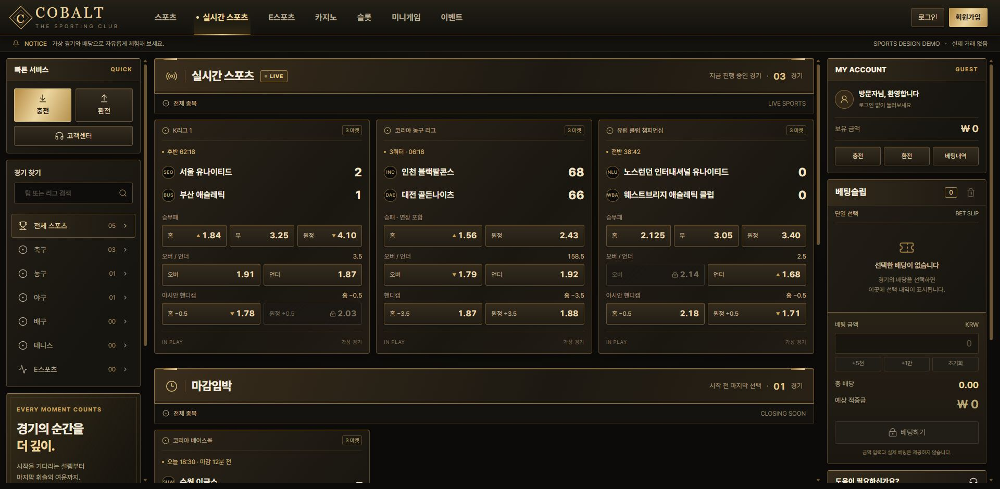
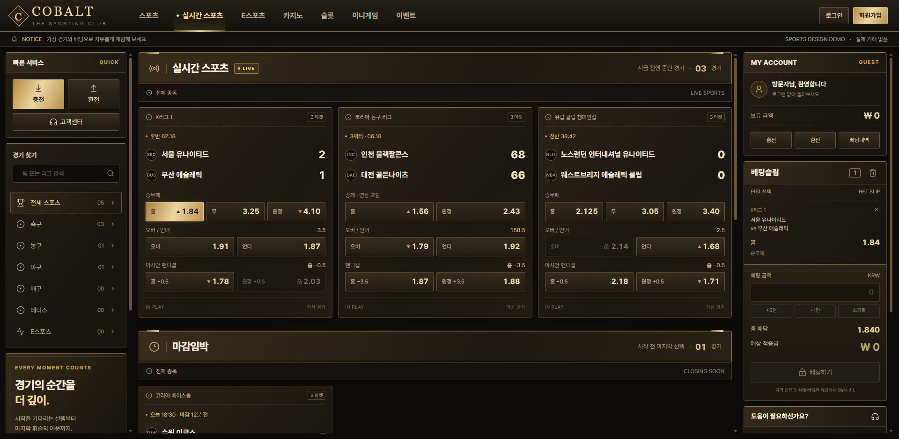

# sports-demo-01 · 첫 사이클 인계





- 상태: **대표 UI 제작 및 실제 브라우저 통제 검증 완료 / 사용자 미감 검수 대기**. 전체 페이지 확장과 배포는 하지 않았다.
- 독립 ID: `sports-demo-01`. 화면의 COBALT는 임시 명칭이며 기존 COBALT 프로젝트와 별개다.
- 로컬 URL: **http://127.0.0.1:5276/**
- 프로젝트: `E:/codexwork/Site-Skin-edit/demo-sites/sports-demo-01/site/`
- CUA: Codex In-app Browser, browser ID `1`, **탭 ID `1`**. 새 작업 전용 탭을 재사용했다. 결과 탭 유지 표시 후 CUA 세션 reset 완료. `open_in_codex`는 호출하지 않았다.
- 서버: `127.0.0.1:5276`만 LISTEN, 확인 시 PID `41604`, 실행 세션 `50961`. 검수용 서버는 유지했다. 기존 3000 서버는 조작하지 않았다.

## 실행

```powershell
Set-Location 'E:\codexwork\Site-Skin-edit\demo-sites\sports-demo-01\site'
npm run dev -- --hostname 127.0.0.1 --port 5276
```

이미 실행 중이면 새 서버를 중복 시작하지 않는다. 재설치가 필요할 때만 이 폴더에서 `npm ci`를 사용한다. 빌드는 `npm run build`, 타입 검사는 `npx tsc --noEmit`이다. 지정 포트가 사용 중이면 해당 프로세스를 임의로 종료하지 않는다.

## 구현 범위와 변경 파일

| 경로 | 내용 |
| --- | --- |
| `site/` | 빈 경로에 `@openai/create-sites@0.3.0`, `shadcn` add-on으로 신규 초기화. 생성된 Vinext/Vite/npm 구조 보존 |
| `site/app/page.tsx` | Header, SectionTitle, BettingCard, 좌우 Panel, Slip. 선택/재선택/개별 제거/전체 제거, 메뉴의 단일 페이지 안내 |
| `site/app/globals.css` | 블랙·골드·아이보리 토큰, 68px 헤더 + 32px 공지, 272px/가변/320px 열, 12px 간격, 독립 스크롤, 금속 프레임·버튼 상태 |
| `site/app/motion.css` | 카드 호버 광택, 호버 시간, LIVE 대기 효과의 독립 조절값 |
| `site/app/demo-data.ts` | 고정 가상 경기 5개: 실시간 3, 마감임박 1, 인기 1. 각 3개 마켓. 대표 UI·엣지 상태 검수용이며 전체 목록 확장 아님 |
| `site/app/layout.tsx`, `typography.css`, `public/fonts/pretendard-jp/`, `public/favicon.svg` | 한국어 메타데이터, Pretendard JP 400/500/700/800/900와 라이선스, 문자 기반 심벌 |
| `qa/` | 실제 캡처 16장, 관측 JSON, 빌드/검사 로그, 감사 결과, 소스 이력·해시, 이 인계 |

신규 스타터 전체 파일의 바이트 수와 SHA-256은 [source-manifest.json](source-manifest.json)에 있다. 외부 Adobe 서체는 사용하지 않았으며 그 로딩을 검증했다고 주장하지 않는다. 폰트 스킬의 Vinext 어댑터 방식으로 로컬 번들을 해시 검증하여 설치했다. 가짜 index.html을 만들지 않았다.

현재 의도한 상태는 **실시간 스포츠 활성 / 방문자 / 빈 슬립 / 금액 0 / 세 열 최상단 / 광택 0.32 / 제목 경계 #93703a 및 장식 표시 / LIVE 애니메이션 on(2400ms)**이다. 새로고침하면 같은 기본 상태로 시작한다. 금액·검색·인증은 완성 범위 밖이므로 입력이나 거래 버튼을 활성화하지 않았다.

## 실제 화면 환경

- 원래 IAB 콘텐츠 영역은 `innerWidth=1280`, `innerHeight=720`이었다.
- 요청한 데스크톱 너비 검수를 위해 지원되는 viewport API로 **1920×940 콘텐츠 영역**을 설정했다. 1080px를 콘텐츠 높이로 사용하지 않았다. 캡처 16장 모두 실제 1920×940이며 전체 페이지를 축소한 합성물이 아니다.
- 브라우저가 보고한 `screen.width=1920`, `screen.height=1080`, `availWidth=1920`, `availHeight=1080`, DPR=1, visualViewport.scale=1, CSS zoom=1. **브라우저 UI의 확대율 표시는 확인하지 못했으므로 100%라고 단정하지 않는다.** OS 모니터 설정을 별도 검사하지 않았다.
- 임시 viewport override를 해제한 뒤 1280×720로 복귀했다. 앱 사이드 패널 등 좁은 콘텐츠 영역에서는 고정 데스크톱 레이아웃이 잘린다. 반응형 분기·전체 축소는 요청 범위에 포함하지 않았다. 실제 1차 디자인 판단은 1920px 콘텐츠 너비의 캡처/브라우저를 기준으로 해야 한다.
- 증거: [environment-fonts.json](environment-fonts.json), [screenshot-manifest.json](screenshot-manifest.json).

## 실제 검증 결과

| 검증 | 결과와 관측 근거 |
| --- | --- |
| 배당 선택 → 슬립 → 제거 | 통과. 빈 상태→서울 홈 1.84 1개→개별 제거 0개. 3개 선택과 전체 제거도 확인 |
| 동일 경기 교체 / 키보드 | 통과. 서울 홈→원정 교체 때 해당 경기 항목 하나만 유지. Enter로 해제·다시 선택 확인 |
| 긴 이름 / 소수 / 잠금 | 통과. 긴 가상 팀명이 카드·슬립에서 읽히며 2.125 유지. 검수 너비에서 팀명·배당의 가로 overflow 0개. 잠금 버튼 클릭 후 선택 0개 유지 |
| 버튼 상태 / 프레임 | 기본·호버·금색 선택·사선 잠금 구별. 실제 mousedown 시 `:active=true`, transform Y=1px, inset shadow, 배경 #a7864d 읽음. 눌림 상태는 정지 캡처 대신 실제 이벤트 당시 관측 로그로 확인 |
| 좌·중·우 독립 스크롤 | 통과. 좌측 379, 중앙 1044, 우측 370px 끝 위치 후 추가 휠에서 다른 열 불변. 헤더 x/y=0, 높이 68 유지 |
| 슬립 목록의 끝 전파 | 통과. 목록 clientHeight=270, scrollHeight=412, 끝 scrollTop≈141에서 추가 휠에도 세 열 scrollTop=0 유지. 금액/합계/버튼은 목록 밖에 남으며 우측 스크롤로 접근 |
| 폰트 | 로컬 5개 파일+라이선스 해시 일치. 실제 `document.fonts.load` 400/700/800 loaded, UI·버튼·input의 computed family 일치. 한글/영문/숫자와 실제 문구의 캡처 확인 |
| 매체 / 메뉴 | DOM img=0, video=0. 기본 벡터 UI 아이콘만 사용. 카지노 메뉴는 같은 페이지 안내만 표시하고 실시간 스포츠 활성 상태로 복원 |

상세 시계열은 [browser-evidence.json](browser-evidence.json), 실제 눌림 관측은 [press-console.json](press-console.json), 다중 선택 및 스크롤은 `screenshots/03-*`, `04-*`, `scroll-*`를 확인한다. 3개 선택 총 배당은 `1.84 × 1.56 × 2.125 = 6.0996`, 표시 규칙에 따라 `6.100`이다. 금액 계산·거래는 구현하지 않았다.

### 소스 수정 통제 A / B / C

| 테스트 | 실제 소스 변경 | 실제 브라우저 결과 | 유지 항목 |
| --- | --- | --- | --- |
| A | motion.css 광택 0.32→0.9 | 카드의 대각 광택이 강해짐. 실제 hover=true, pseudo opacity 0.32→0.9 | 전체 프레임 좌표·크기, 글자, 선택 1개, 슬립, 세 열 스크롤 일치 |
| B | globals.css 제목 경계 #93703a→#f0d99e, 장식 opacity 1→0 | 제목판 경계가 밝아지고 상단 장식 사라짐 | 헤더·카드·슬립 좌표와 크기, 선택·스크롤 일치 |
| C | motion.css live-breathe→none→live-breathe | off 동안 opacity=1로 고정. on 때 0.894→0.530→0.457로 변함. 두 모드에서 두 번째 선택→제거 작동 | 전환 전후 동일 데이터·선택·스크롤의 비교에서 프레임·슬립 일치 |

- 캡처: [A 전](screenshots/A-before.jpg) / [A 후](screenshots/A-after.jpg), [B 전](screenshots/B-before.jpg) / [B 후](screenshots/B-after.jpg), [C on](screenshots/C-on-before.jpg) / [C off](screenshots/C-off.jpg) / [C 복원](screenshots/C-on-restored.jpg).
- 코드 변경만으로 판정하지 않았다. 실제 캡처·화면 관측·DOM 치수와 상태를 함께 비교했다. 모든 유지 비교가 true인 기록은 [control-comparison.json](control-comparison.json)에 있다.
- 검수 후 motion.css와 globals.css가 기준 백업과 **바이트 단위 동일**함을 확인했다. 계측용 QaProbe는 소스에서 제거했다. 그 원본은 qa/source-history에만 보관한다.

## 기술 검증과 남은 위험

- `npm run build`: exit 0. `npx tsc --noEmit`: exit 0. [technical-result.json](technical-result.json), [build-final.log](build-final.log). Vinext의 route static classification Unknown 안내는 남지만 빌드는 성공했다. 배포 또는 Cloudflare 운영 런타임 검증은 수행하지 않았다.
- 작성 파일 대상 `npx oxlint app/page.tsx app/demo-data.ts app/layout.tsx`: exit 0. 세 독립 스크롤 영역의 키보드 포커스를 위해 no-noninteractive-tabindex 규칙만 설명과 함께 제한적으로 해제했다.
- 전체 `npm run lint`: **exit 1, 스타터 components/ui·hooks의 19건**. 작성 app 파일 오류는 0건. vendored 컴포넌트는 수정하지 않았다. [lint-final.log](lint-final.log).
- 브라우저: 기능 검수 중 runtime error 없음. 계측 파일 제거 순간 HMR에 삭제 파일 재로드 오류 1건이 남았으나 최종 새로고침 후 errors/warnings 0건, 카드 5개·기본 선택 확인. 과거 로그를 숨기지 않고 [console-health.json](console-health.json), [final-reload.json](final-reload.json)에 분리했다.
- `npm audit`: **11건 = high 8 + moderate 2 + low 1**, critical 0. `npm audit fix --force`나 의존성 업그레이드를 하지 않았다. 아래 영향 구분과 [npm-audit.json](npm-audit.json)을 참조한다.

| 등급 | 관련 패키지 |
| --- | --- |
| high 8 | image-size, miniflare, react-server-dom-webpack, sharp, undici, vinext, vite, ws |
| moderate 2 | @cloudflare/vite-plugin, wrangler |
| low 1 | esbuild |

감사 결과는 패키지 단위 집계이며 독립된 공격 11개를 재현했다는 뜻이 아니다. 이번은 loopback(127.0.0.1) 전용, 이미지·업로드·사용자 Server Functions·실거래 없는 로컬 디자인 검수다. 이 범위는 노출 경로를 줄이지만 **취약점 해결을 의미하지 않는다**. 특히 Vite Windows 파일 접근/launch-editor, esbuild Windows 개발 서버, WebSocket 관련 항목은 개발 환경과 관련될 수 있어 남은 위험으로 유지한다. 공개 호스팅이나 서버 외부 노출 전에는 별도 의존성 수정·호환성 검증이 필요하다. 개별 권고의 정확한 범위와 URL은 감사 JSON의 `via`에 기록되어 있다.

## 자료·소스 이력·보존

- 읽은 지시서: input/SPORTS_DEMO_CYCLE_01.md R2, 2026-09-16. 작업 전후 SHA-256 `E76A946E8B895B4AA32862399E746EE8A57003FBA95DF8A6DE6B8EF16DCE9EA5` 일치.
- 설치된 Sites 스킬: `C:/Users/User/.codex/plugins/cache/openai-bundled/sites/0.1.57/skills/sites-building/SKILL.md` 및 environment.md. Windows 로컬 capability path 사용. 제공 도구 목록에서 Sites create/save/deploy/get 등을 확인했으나 **Sites 호출은 하지 않았다**. hosting.json은 `{d1:null,r2:null}`, project_id 없음.
- 초기 상위 폴더에서 실행한 initializer는 기존 input/qa/INDEX 때문에 안전하게 거부되었다. 이후 확인된 빈 site/에 최초 성공 초기화했다. 원본·INDEX는 바뀌지 않았다.
- 소스 이력: `source-history/baseline/` → A/B/C 한정 diff 및 변형 CSS → `source-history/final/`. 최종 snapshot에는 계측 코드가 없다. Git 초기화/브랜치/커밋 없이 파일 복사·SHA-256으로 기록했다.
- 중간 보완: 긴 팀명의 행 높이 고정, 소수 2자리/3자리 판별의 부동소수 오차 제거, 실제 눌림 상태의 transition 제거. 통제 테스트 시작 전 서울 2:1 경기의 전체 O/U를 2.5→3.5로 정정했다.
- 실제로 열어 본 시각 참고: [COBALT](https://titan-solution-t03.pages.dev/), [CAT VILLAGE](https://titan-solution-t01.pages.dev/), [HADES](https://hades-arcade-v0-1.kexxadrix.chatgpt.site/). 페이지를 읽기 전용으로 봤으며 프레임워크·원본 코드의 증거로 사용하지 않았다.
- **미확인:** WOG 운영 화면, 별도 4종 상세 이미지, 카지노 이미지 5종. 제공되지 않았으므로 해당 품질 기준과의 직접 비교 통과를 주장하지 않는다.
- **변경하지 않음:** input 원본, 스포츠 폴더 INDEX, 상위 README, titan_promotion, HADES, 기존 데모/자산, 3000 서버. 이미지 생성·검색·삽입·영상, 중앙 히어로·카지노 갤러리, 반응형 분기, 개발 슬라이더, 실인증·DB·결제, 전체 페이지 확장·Sites 등록/배포·접근 권한 변경은 하지 않았다.
- **사용자 판단 필요:** 골드 경계와 광택 강도, 카드/제목 크기·밀도, 현재 대표 배치의 미감. 첫 사이클의 기술 검증과 사용자 미감 승인은 별개다. 다음 단계는 사용자 대표 UI 검수 결과 반영이며 승인 전 전체 페이지로 확장하지 않는다.
