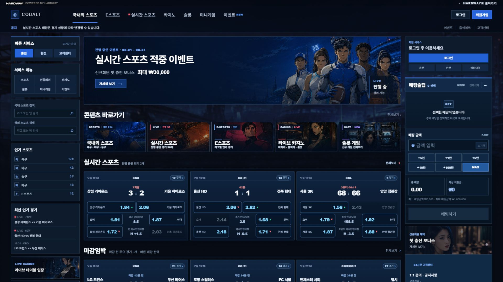
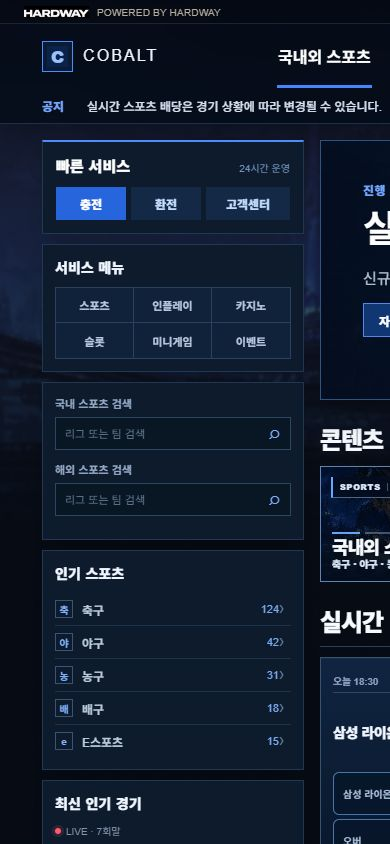

# SiteSkin 예시 사이트 분석서

문서 버전: **v0.1** · 작성일: **2026-09-09**  
연결: [안내](00_INDEX.md) · [공통 작업 규약](01_WORK_RULES.md) · [테마 양식](03_THEME_TEMPLATE.md)

## 1. 대상·시점·환경·판정 범위

- **확인됨 — 대상 URL:** [COBALT | P04 V4 서비스 로비](https://snake-eyes-cinematic-demo.kexxadrix.chatgpt.site/mockups/prototype-04-v4)
- **확인됨 — 조사 시점:** 2026-09-09 12시대 KST. 개별 계측 시각은 JSON의 `observedAt`에 UTC로 기록되어 있다. 예: 좁은 화면 측정 03:09:01 UTC = 12:09:01 KST.
- **확인됨 — 환경:** Windows 작업공간, Codex 인앱 브라우저, 비로그인 표시 상태. 최초 뷰포트 1828×960, 기준 비교 1920×1080, 좁은 화면 390×844. 기준 DPR=1. 좁은 화면은 CSS 뷰포트 검사이며 실제 휴대전화·터치 환경 검증이 아니다.
- **확인됨 — 자료:** 실제 화면, 접근성/DOM 관찰, computed style, 현재 페이지 자산 목록, 그 목록에서 가져온 배포 CSS 2개 및 이미지 2개. 다른 로컬 프로젝트를 사용하지 않았다.
- **확인 필요 — 원본:** 저작 소스 경로, 컴포넌트 구현·프레임워크·빌드 구조, API·서버 연결. 배포 자산과 DOM 클래스는 관찰 가능하지만 원본 파일·아키텍처로 확정하지 않는다.
- **확인됨 — 범위 제한:** 거래 실행, 가입, 계정 로그인, 금액 입력, 배당 선택, 게임 입장·외부 연결은 하지 않았다. 공개 화면과 비거래 제어만 관찰했다.

첫 자동 브라우저 선택은 시간 초과, Edge 연결은 사용 불가였고, 검색용 웹 도구도 이 URL을 열지 못했다. 이후 실제 사용 가능한 인앱 브라우저에서 페이지와 근거를 확인했다. 이는 사이트 보안 경고를 우회한 작업이 아니다. 별도 패키지 설치나 브라우저 설정 영구 변경 없이 수행했고 임시 뷰포트 설정은 복원했다.

이 문서의 **확인됨**은 아래 근거가 보여 주는 시점·페이지에 한정한다. 화면의 ‘LIVE’, 인원·경기 수, 이벤트 날짜, ‘공식 파트너’ 문구는 화면에 표시된 콘텐츠이며 실제 운영·실시간성·제휴의 증거가 아니다.

## 2. 근거 목록

아래 경로는 이 문서에 상대적이다. 스크린샷은 관찰 자료이며 생성·승인된 스킨 자산이 아니다.

| 근거 | 내용 | 파일 |
|---|---|---|
| E01 | 최초 1828×960 화면, 오른쪽 잘림 | [화면](evidence/2026-09-09/01-desktop-1828.png) |
| E02 | 1920×1080 기준 상단 및 전체 문서 화면(1920×2565) | [상단](evidence/2026-09-09/02-desktop-top.png), [전체](evidence/2026-09-09/02-desktop-full.png) |
| E03 | 기준 DOM, IMG 자연 크기·표시 박스·fit·position, 레이아웃 계측 | [DOM](evidence/2026-09-09/02-desktop-dom.txt), [JSON](evidence/2026-09-09/02-desktop-metrics.json) |
| E04 | 현재 페이지에서 관찰된 리소스 목록 | [자산 목록](evidence/2026-09-09/03-page-assets.json), [수집 내역](evidence/2026-09-09/03-bundle-manifest.json) |
| E05 | 현재 페이지가 참조한 배포 CSS 사본 | [페이지 CSS](evidence/2026-09-09/Prototype04V4-BczRFVlc.css), [공통 CSS](evidence/2026-09-09/index-B3WV_FlX.css) |
| E06 | 베팅슬립 접힌 상태 | [화면](evidence/2026-09-09/04-slip-collapsed.png), [DOM](evidence/2026-09-09/04-slip-collapsed-dom.txt) |
| E07 | 로그인 버튼 클릭 뒤 공지 변경; 파일명의 panel은 캡처 이름일 뿐 로그인 패널이 열린 것이 아님 | [화면](evidence/2026-09-09/05-login-panel.png), [DOM](evidence/2026-09-09/05-login-panel-dom.txt) |
| E08 | 국내 검색 입력 후 화면과 DOM | [화면](evidence/2026-09-09/06-search-focus.png), [DOM](evidence/2026-09-09/06-search-dom.txt) |
| E09 | 카지노 메뉴 클릭 후 안내 변경, 하단 카탈로그·푸터 | [메뉴 클릭](evidence/2026-09-09/07-casino-menu.png), [DOM](evidence/2026-09-09/07-casino-navigation-dom.txt), [하단 화면](evidence/2026-09-09/08-catalog-footer.png) |
| E10 | 390×844에서의 잘림과 고정 레이아웃 | [화면](evidence/2026-09-09/09-mobile-390.png), [DOM](evidence/2026-09-09/09-mobile-dom.txt), [계측](evidence/2026-09-09/09-mobile-metrics.json) |
| E11 | 히어로 HTML, 배당 버튼·기호·색, 이미지 로딩과 수집 로그 | [상세](evidence/2026-09-09/10-ui-details.json), [브라우저 상태](evidence/2026-09-09/10-browser-health.json) |
| E12 | 첫 스포츠 바로가기의 실제 호버 | [화면](evidence/2026-09-09/11-quick-hover.png), [측정](evidence/2026-09-09/11-hover.json) |
| E13 | 같은 카드의 키보드 포커스 | [화면](evidence/2026-09-09/12-quick-focus.png), [측정](evidence/2026-09-09/12-focus.json) |
| E14 | 히어로·배경의 읽기 가능한 원본 사본과 메타데이터·해시 | [히어로](evidence/2026-09-09/observed-event-hero-158-767.png), [배경](evidence/2026-09-09/observed-stadium-city-fixed.png), [메타데이터](evidence/2026-09-09/13-source-image-metadata.json) |

E04의 임시 수집 경로는 수집 당시의 기록이다. 오래 유지할 근거는 E05/E14의 이 폴더 안 사본을 사용한다. CSS 사본은 조사 자료이므로 여기서 편집해 사이트에 적용하지 않는다.

## 3. 화면 영역과 역할

**확인됨:** 다음 영역·수량·구성은 E02/E03/E09에서 관찰했다. 스킨 대상 열은 **제안**이다. 영역 ID는 파일 경로나 원본 컴포넌트명이 아니다.

| 영역 ID | 영역·역할 | 포함 요소·반복 | 스킨 변경 대상(제안) |
|---|---|---|---|
| REF-A000 | 페이지 배경 | 도시·경기장 장면을 고정 배경으로 1회 표시 | REF-R001, 가독성용 표면·오버레이 |
| REF-A001 | 데모 포털 바 | HARDWAY 이미지, POWERED BY 문구, /mockups로 돌아가는 링크 | 데모 포털을 서비스 헤더와 분리하고 기본 보존 |
| REF-A002 | 서비스 헤더 | C + COBALT 문자 브랜드, 주요 메뉴 7개, 로그인·회원가입 | 브랜드 권한 확인, 메뉴·버튼·선·간격 |
| REF-A003 | 공지 바 | 공지 레이블, 한 줄 안내, 이벤트·출석체크·고객센터 | 긴 공지·동적 안내의 가독성, ellipsis 유지 검토 |
| REF-A004 | 좌측 서비스 탐색 | 빠른 서비스 3개, 메뉴 6개, 검색 2개, 인기 종목 5개, 최신 경기 3개, 하단 유틸리티 6개 | 공통 박스·작은 버튼·입력·목록·수치 |
| REF-A005 | 좌측 보조 배너 | 라이브 카지노와 미니게임 2개 | REF-R004/005와 HTML 문구·크롭 |
| REF-A006 | 메인 이벤트 히어로 | 1개 이미지, 기간, 제목, 보너스·금액, CTA, 우하단 상태 | REF-R003, HTML 문구·버튼·상태 영역 |
| REF-A007 | 콘텐츠 바로가기 | 스포츠·실시간·E스포츠·카지노·슬롯 5개 | REF-R006~010, 반복 카드·상태 배지 |
| REF-A008 | 실시간 스포츠 | 경기 카드 3개, 카드당 배당 버튼 6개 | 반복 카드·숫자·상승/하락·비활성 구분 |
| REF-A009 | 마감임박 | 경기 카드 3개, 남은 시간·리그·배당 | REF-A008과 공통 UI 후보 |
| REF-A010 | 인기 경기 | 경기 카드 3개, 순위·리그·배당 | REF-A008과 공통 UI 후보 |
| REF-A011 | 라이브 카지노 | 제공사 아트 카드 4개, 로고·이름·정보·게임 입장 문구 | 아트와 로고를 별도 정책으로 취급 |
| REF-A012 | 슬롯 게임 | 제공사 아트 카드 4개, NEW/POPULAR/JACKPOT 등 배지 | 아트·브랜드·게임 정체성 보존 조건 확인 |
| REF-A013 | 우측 회원·입력 패널 | 로그인 전 서비스, 베팅슬립, KEEP·금액 입력·빠른 금액·합계·실행 버튼 | 기능·의미·계산을 보존하고 표면·상태 스타일만 검토 |
| REF-A014 | 우측 보조 배너 | 신규회원 보너스 이미지 배너, 고객센터 텍스트 배너 | REF-R019 조건부 교체, 지원 패널은 구조적 UI |
| REF-A015 | 파트너 영역 | ‘공식 파트너’ 문구와 로고 16개, 8열×2행 | 로고 원형·비율 보존, 배경·간격만 검토 |
| REF-A016 | 푸터 | C + COBALT 문자 브랜드, 서비스 요약, 약관·개인정보·고객센터 버튼 | 브랜드·고지·탐색 보존, 표면·타입 |

### 레이아웃 계측

**확인됨(E03/E05):** `main`의 computed `min-width`는 1920px. 중앙 shell은 너비 1836px, 열은 262px / 1210px / 332px, 열 간격은 16px이다.

계산: 262 + 1210 + 332 + (16 × 2) = **1836px**. 1920px 화면의 양쪽 여백은 (1920 − 1836) ÷ 2 = **42px**다. 이는 예시의 현재 측정값이며 실제 원본의 기본 폭으로 채택하는 제안이 아니다.

### 현재 화면의 시각적 특성

**확인됨 — 화면 관찰(E02/E09):** 어두운 남색 페이지와 야간 도시·경기장 배경, 파란 강조색, 가는 밝은 테두리의 패널이 반복된다. 히어로와 스포츠 바로가기는 인물 중심의 일러스트 장면이며, 카지노 카드는 인물과 실내 장면, 슬롯 카드는 금색·보석색이 강한 서로 다른 아트를 사용한다. 모든 이미지가 같은 색으로 통일된 구성은 아니다. 작은 메뉴·배당·수치는 밀도 높게 배치되고 섹션 제목은 더 크고 굵게 표시된다.

**확인됨 — 스타일 선언(E11):** main의 computed font-family는 `Arial, "Noto Sans KR", sans-serif`, 문자색은 rgb(239,245,255)다. 실제 각 글리프를 그린 폰트 파일과 폰트 사용 권한은 확인 필요다. **제안:** 이 관찰을 새 테마로 채택하지 않고, 향후 DNA에서 공통 색·표면과 역할별 아트 강도를 분리하는 참고로만 사용한다.

## 4. 이미지·텍스트·구조적 UI 분리

| 상태 | 관찰 | 처리 방향 |
|---|---|---|
| 확인됨 | REF-A006의 IMG 다음에 shade DIV, 문구 DIV, H1, P/STRONG, BUTTON, 별도 상태 DIV가 있다(E11). 원본 히어로에도 같은 제목·금액·버튼이 없다(E14). | 제안: 이미지는 장면만, 문구·금액·CTA·상태는 HTML 유지. 왼쪽 문구 및 우하단 상태 안전 영역을 명세에 연결한다. |
| 확인됨 | 바로가기 5개는 각각 별도 IMG와 배지·제목·설명 HTML을 사용한다(E03/E05). | 제안: 같은 문구와 가짜 버튼을 생성 이미지에 넣지 않는다. 작은 표시 창에서 식별되는 구도가 우선이다. |
| 확인됨 | 카지노·슬롯 각 카드는 아트 IMG와 제공사 로고 IMG, 이름·상태·정보·입장 문구가 분리된다(E03/E09). | 제안: 아트 교체 여부와 로고 보존을 별도 판정한다. 실제 표지 여부는 원본·권리 확인 후 결정한다. |
| 확인됨 | 경기 팀명·시각·점수·배당·기호는 DOM 텍스트, 배당 선택 대상은 BUTTON이다. `aria-pressed=false`, 일부 `disabled`가 있다(E11). | 제안: 경기 카드를 이미지 한 장으로 만들지 않는다. 의미색·텍스트·상태·로직을 보존한다. |
| 확인됨 | COBALT의 C와 이름은 헤더·푸터에서 문자 요소로 보인다. 별도 COBALT IMG는 이 페이지 목록에 없다(E03). | 제안: 새 로고 이미지를 자동 생성하지 말고 브랜드 변경 권한부터 확인한다. |
| 확인됨 | 선·패널·오버레이·clip-path·그림자·호버·포커스 규칙은 배포 CSS에서 확인된다(E05). | 제안: 원본 CSS/컴포넌트에 대응해 최소 수정한다. 이미지화하지 않는다. |
| 해당 없음(이 스냅샷) | 자산 목록에 video 0개, inline SVG 0개(E04). | 다른 상태·다른 페이지까지 없다고 단정하지 않는다. |

## 5. 이미지 리소스 등록부

### 5.1 범위와 식별 원칙

**확인됨(E03/E04):** IMG 요소 42개 − Pragmatic 로고의 중복 1개 = 고유 IMG URL 41개. 여기에 CSS 배경 1개를 더하여 **고유 이미지 URL 42개**다. 아래는 이 42개를 전부 등록한 목록이다. 숨겨진 다른 페이지·로그인 후·동적 콘텐츠의 전체 자산 목록은 아니다.

**확인됨:** 페이지는 URL 경로에 prototype-04-v4와 prototype-04-v3가 포함된 이미지를 함께 참조한다. 이것만으로 저작 소스의 프로젝트 관계나 이관 이력을 판단할 수 없다.

**확인 필요 — 모든 행에 공통:** 실제 저작 소스 경로, 권리자·사용 허락, 다른 페이지와의 공유, 로그인/데이터 상태별 변형은 미확인이다. URL 링크는 실제 관찰된 브라우저 주소이며 로컬 원본 파일 경로가 아니다. 예외적으로 E14의 두 로컬 파일은 분석용 다운로드 사본이다.

**제안 — 정책:** ‘교체 후보’ 9개도 권리·테마·규격이 확인되어야 생성 대상이 된다. ‘조건부 교체’ 9개는 실제 콘텐츠 표지/브랜드 캠페인인지 확인할 때까지 보존한다. ‘보존’ 24개는 포털 로고 1개 + 제공사 로고 7개 + 파트너 로고 16개다. 생성·승인된 리소스 수는 이번 단계에서 0개다.

### 5.2 역할·주소·정책

아래 이름·주소·사용 수는 **확인됨**이다. ID와 정책/프로필 체계는 **제안으로 부여한 추적 체계**이며 이후 ID를 재사용·재번호 매기기 하지 않는다.

| ID | 화면상 역할·이름 | 사용 영역 | 브라우저 리소스 URL | 규격 프로필 | 교체 정책(제안) | 이 페이지 사용 수 |
|---|---|---|---|---|---|---|
| REF-R001 | 페이지 고정 배경 | REF-A000 | [stadium-city-fixed.png](https://snake-eyes-cinematic-demo.kexxadrix.chatgpt.site/media/showcase/prototype-04-v4/backgrounds/stadium-city-fixed.png) | P-BG | 교체 후보 | 1 |
| REF-R002 | HARDWAY 포털 로고 | REF-A001 | [hardway-150-1191.png](https://snake-eyes-cinematic-demo.kexxadrix.chatgpt.site/media/showcase/prototype-04-v3/nav/hardway-150-1191.png) | P-PORTAL | 보존 | 1 |
| REF-R003 | 이벤트 히어로 | REF-A006 | [event-hero-158-767.png](https://snake-eyes-cinematic-demo.kexxadrix.chatgpt.site/media/showcase/prototype-04-v4/hero/event-hero-158-767.png) | P-HERO | 교체 후보 | 1 |
| REF-R004 | 좌측 라이브 카지노 배너 | REF-A005 | [live-table.png](https://snake-eyes-cinematic-demo.kexxadrix.chatgpt.site/media/showcase/prototype-04-v4/rail-banners/live-table.png) | P-RAIL | 교체 후보 | 1 |
| REF-R005 | 좌측 미니게임 배너 | REF-A005 | [mini-game.png](https://snake-eyes-cinematic-demo.kexxadrix.chatgpt.site/media/showcase/prototype-04-v4/rail-banners/mini-game.png) | P-RAIL | 교체 후보 | 1 |
| REF-R006 | 스포츠 바로가기 | REF-A007 | [quick-link-sports-158-808.png](https://snake-eyes-cinematic-demo.kexxadrix.chatgpt.site/media/showcase/prototype-04-v4/quick-links/quick-link-sports-158-808.png) | P-QUICK | 교체 후보 | 1 |
| REF-R007 | 실시간 스포츠 바로가기 | REF-A007 | [quick-link-inplay-158-821.png](https://snake-eyes-cinematic-demo.kexxadrix.chatgpt.site/media/showcase/prototype-04-v4/quick-links/quick-link-inplay-158-821.png) | P-QUICK | 교체 후보 | 1 |
| REF-R008 | E스포츠 바로가기 | REF-A007 | [quick-link-esports-158-834.png](https://snake-eyes-cinematic-demo.kexxadrix.chatgpt.site/media/showcase/prototype-04-v4/quick-links/quick-link-esports-158-834.png) | P-QUICK | 교체 후보 | 1 |
| REF-R009 | 카지노 바로가기 | REF-A007 | [quick-link-casino-158-847.png](https://snake-eyes-cinematic-demo.kexxadrix.chatgpt.site/media/showcase/prototype-04-v4/quick-links/quick-link-casino-158-847.png) | P-QUICK | 교체 후보 | 1 |
| REF-R010 | 슬롯 바로가기 | REF-A007 | [quick-link-slots-158-860.png](https://snake-eyes-cinematic-demo.kexxadrix.chatgpt.site/media/showcase/prototype-04-v4/quick-links/quick-link-slots-158-860.png) | P-QUICK | 교체 후보 | 1 |
| REF-R011 | Evolution 카지노 아트 | REF-A011 | [evolution.png](https://snake-eyes-cinematic-demo.kexxadrix.chatgpt.site/media/showcase/prototype-04-v4/catalog/casino/evolution.png) | P-CATALOG | 조건부 교체 | 1 |
| REF-R012 | Pragmatic Live 카지노 아트 | REF-A011 | [pragmatic-live.png](https://snake-eyes-cinematic-demo.kexxadrix.chatgpt.site/media/showcase/prototype-04-v4/catalog/casino/pragmatic-live.png) | P-CATALOG | 조건부 교체 | 1 |
| REF-R013 | Dream Gaming 카지노 아트 | REF-A011 | [dream-gaming.png](https://snake-eyes-cinematic-demo.kexxadrix.chatgpt.site/media/showcase/prototype-04-v4/catalog/casino/dream-gaming.png) | P-CATALOG | 조건부 교체 | 1 |
| REF-R014 | Playtech Live 카지노 아트 | REF-A011 | [playtech-live.png](https://snake-eyes-cinematic-demo.kexxadrix.chatgpt.site/media/showcase/prototype-04-v4/catalog/casino/playtech-live.png) | P-CATALOG | 조건부 교체 | 1 |
| REF-R015 | Pragmatic 슬롯 아트 | REF-A012 | [slots.png](https://snake-eyes-cinematic-demo.kexxadrix.chatgpt.site/media/showcase/prototype-04-v3/quick-links/slots.png) | P-CATALOG | 조건부 교체 | 1 |
| REF-R016 | NetEnt 슬롯 아트 | REF-A012 | [netent.png](https://snake-eyes-cinematic-demo.kexxadrix.chatgpt.site/media/showcase/prototype-04-v3/catalog/slots/netent.png) | P-CATALOG | 조건부 교체 | 1 |
| REF-R017 | Habanero 슬롯 아트 | REF-A012 | [habanero.png](https://snake-eyes-cinematic-demo.kexxadrix.chatgpt.site/media/showcase/prototype-04-v3/catalog/slots/habanero.png) | P-CATALOG | 조건부 교체 | 1 |
| REF-R018 | PG Soft 슬롯 아트 | REF-A012 | [pgsoft.png](https://snake-eyes-cinematic-demo.kexxadrix.chatgpt.site/media/showcase/prototype-04-v3/catalog/slots/pgsoft.png) | P-CATALOG | 조건부 교체 | 1 |
| REF-R019 | 신규회원 보너스 배너 | REF-A014 | [new-member-casino.png](https://snake-eyes-cinematic-demo.kexxadrix.chatgpt.site/media/showcase/prototype-04-v3/campaign/new-member-casino.png) | P-CAMPAIGN | 조건부 교체 | 1 |
| REF-R020 | Evolution Gaming 로고 | REF-A011 | [evolution.png](https://snake-eyes-cinematic-demo.kexxadrix.chatgpt.site/media/showcase/prototype-04-v3/brand-logos/evolution.png) | P-LOGO | 보존 | 1 |
| REF-R021 | Pragmatic Play 공유 로고 | REF-A011 / REF-A012 | [pragmatic.png](https://snake-eyes-cinematic-demo.kexxadrix.chatgpt.site/media/showcase/prototype-04-v3/brand-logos/pragmatic.png) | P-LOGO | 보존 | 2 |
| REF-R022 | Dream Gaming 로고 | REF-A011 | [dreamgaming.png](https://snake-eyes-cinematic-demo.kexxadrix.chatgpt.site/media/showcase/prototype-04-v3/brand-logos/dreamgaming.png) | P-LOGO | 보존 | 1 |
| REF-R023 | Playtech Live 로고 | REF-A011 | [playtech.png](https://snake-eyes-cinematic-demo.kexxadrix.chatgpt.site/media/showcase/prototype-04-v3/brand-logos/playtech.png) | P-LOGO | 보존 | 1 |
| REF-R024 | NetEnt 로고 | REF-A012 | [netent.png](https://snake-eyes-cinematic-demo.kexxadrix.chatgpt.site/media/showcase/prototype-04-v3/brand-logos/netent.png) | P-LOGO | 보존 | 1 |
| REF-R025 | Habanero 로고 | REF-A012 | [habanero.png](https://snake-eyes-cinematic-demo.kexxadrix.chatgpt.site/media/showcase/prototype-04-v3/brand-logos/habanero.png) | P-LOGO | 보존 | 1 |
| REF-R026 | PG Soft 로고 | REF-A012 | [pg.png](https://snake-eyes-cinematic-demo.kexxadrix.chatgpt.site/media/showcase/prototype-04-v3/brand-logos/pg.png) | P-LOGO | 보존 | 1 |
| REF-R027 | Asia Gaming 파트너 로고 | REF-A015 | [asiagaming.png](https://snake-eyes-cinematic-demo.kexxadrix.chatgpt.site/media/showcase/prototype-04-v3/partner-logos/asiagaming.png) | P-PARTNER | 보존 | 1 |
| REF-R028 | Big Time Gaming 파트너 로고 | REF-A015 | [bigtimegaming.png](https://snake-eyes-cinematic-demo.kexxadrix.chatgpt.site/media/showcase/prototype-04-v3/partner-logos/bigtimegaming.png) | P-PARTNER | 보존 | 1 |
| REF-R029 | Blueprint Gaming 파트너 로고 | REF-A015 | [blueprint-gaming.png](https://snake-eyes-cinematic-demo.kexxadrix.chatgpt.site/media/showcase/prototype-04-v3/partner-logos/blueprint-gaming.png) | P-PARTNER | 보존 | 1 |
| REF-R030 | GameArt 파트너 로고 | REF-A015 | [gameart.png](https://snake-eyes-cinematic-demo.kexxadrix.chatgpt.site/media/showcase/prototype-04-v3/partner-logos/gameart.png) | P-PARTNER | 보존 | 1 |
| REF-R031 | Galaxsys 파트너 로고 | REF-A015 | [galaxsys.png](https://snake-eyes-cinematic-demo.kexxadrix.chatgpt.site/media/showcase/prototype-04-v3/partner-logos/galaxsys.png) | P-PARTNER | 보존 | 1 |
| REF-R032 | Greentube 파트너 로고 | REF-A015 | [greentube.png](https://snake-eyes-cinematic-demo.kexxadrix.chatgpt.site/media/showcase/prototype-04-v3/partner-logos/greentube.png) | P-PARTNER | 보존 | 1 |
| REF-R033 | Hacksaw Gaming 파트너 로고 | REF-A015 | [hacksaw.png](https://snake-eyes-cinematic-demo.kexxadrix.chatgpt.site/media/showcase/prototype-04-v3/partner-logos/hacksaw.png) | P-PARTNER | 보존 | 1 |
| REF-R034 | JDB 파트너 로고 | REF-A015 | [jdb.png](https://snake-eyes-cinematic-demo.kexxadrix.chatgpt.site/media/showcase/prototype-04-v3/partner-logos/jdb.png) | P-PARTNER | 보존 | 1 |
| REF-R035 | Jili 파트너 로고 | REF-A015 | [jili.png](https://snake-eyes-cinematic-demo.kexxadrix.chatgpt.site/media/showcase/prototype-04-v3/partner-logos/jili.png) | P-PARTNER | 보존 | 1 |
| REF-R036 | LiveBet 파트너 로고 | REF-A015 | [livebet.png](https://snake-eyes-cinematic-demo.kexxadrix.chatgpt.site/media/showcase/prototype-04-v3/partner-logos/livebet.png) | P-PARTNER | 보존 | 1 |
| REF-R037 | Microgaming 파트너 로고 | REF-A015 | [microgaming.png](https://snake-eyes-cinematic-demo.kexxadrix.chatgpt.site/media/showcase/prototype-04-v3/partner-logos/microgaming.png) | P-PARTNER | 보존 | 1 |
| REF-R038 | Nolimit City 파트너 로고 | REF-A015 | [nolimit-city.png](https://snake-eyes-cinematic-demo.kexxadrix.chatgpt.site/media/showcase/prototype-04-v3/partner-logos/nolimit-city.png) | P-PARTNER | 보존 | 1 |
| REF-R039 | Novomatic 파트너 로고 | REF-A015 | [novomatic.png](https://snake-eyes-cinematic-demo.kexxadrix.chatgpt.site/media/showcase/prototype-04-v3/partner-logos/novomatic.png) | P-PARTNER | 보존 | 1 |
| REF-R040 | Play'n GO 파트너 로고 | REF-A015 | [playngo.png](https://snake-eyes-cinematic-demo.kexxadrix.chatgpt.site/media/showcase/prototype-04-v3/partner-logos/playngo.png) | P-PARTNER | 보존 | 1 |
| REF-R041 | Quickspin 파트너 로고 | REF-A015 | [quickspin.png](https://snake-eyes-cinematic-demo.kexxadrix.chatgpt.site/media/showcase/prototype-04-v3/partner-logos/quickspin.png) | P-PARTNER | 보존 | 1 |
| REF-R042 | Skywind 파트너 로고 | REF-A015 | [skywind.png](https://snake-eyes-cinematic-demo.kexxadrix.chatgpt.site/media/showcase/prototype-04-v3/partner-logos/skywind.png) | P-PARTNER | 보존 | 1 |

### 5.3 원본과 표시 규격

**확인됨:** 원본 크기는 IMG의 `naturalWidth/naturalHeight`(E03), CSS 배경은 실제 파일 디코딩(E14). 표시 크기는 1920×1080·DPR 1의 기본 상태(E03)다. W/H는 표의 W ÷ H를 소수 셋째 자리로 반올림했다. fractional CSS px의 너비는 표시 편의를 위해 둘째 자리로 반올림했으며 원시 값은 E03에 보관했다.

| ID | 원본 W×H px | 원본 W/H | 표시 이미지 박스 W×H CSS px | 표시 W/H | fit / position |
|---|---|---|---|---|---|
| REF-R001 | 1920×1084 | 1.771 | 1920×1080 | 1.778 | background-size: cover / 50% 0% |
| REF-R002 | 65×12 | 5.417 | 65×12 | 5.417 | fill / 50% 50% |
| REF-R003 | 1208×258 | 4.682 | 1208×258 | 4.682 | cover / 50% 50% |
| REF-R004 | 1672×941 | 1.777 | 260×84 | 3.095 | cover / 50% 35% |
| REF-R005 | 1672×941 | 1.777 | 260×84 | 3.095 | cover / 50% 43% |
| REF-R006 | 1672×941 | 1.777 | 234.39×114 | 2.056 | cover / 50% 50% |
| REF-R007 | 1672×941 | 1.777 | 234.41×114 | 2.056 | cover / 50% 42% |
| REF-R008 | 1672×941 | 1.777 | 234.39×114 | 2.056 | cover / 50% 42% |
| REF-R009 | 1672×941 | 1.777 | 234.41×114 | 2.056 | cover / 50% 40% |
| REF-R010 | 1672×941 | 1.777 | 234.39×114 | 2.056 | cover / 50% 32% |
| REF-R011 | 1448×1086 | 1.333 | 293.75×249 | 1.180 | cover / 50% 36% |
| REF-R012 | 1448×1086 | 1.333 | 293.75×249 | 1.180 | cover / 50% 36% |
| REF-R013 | 1448×1086 | 1.333 | 293.75×249 | 1.180 | cover / 50% 31% |
| REF-R014 | 1448×1086 | 1.333 | 293.75×249 | 1.180 | cover / 50% 34% |
| REF-R015 | 1254×1254 | 1.000 | 293.75×249 | 1.180 | cover / 50% 42% |
| REF-R016 | 1254×1254 | 1.000 | 293.75×249 | 1.180 | cover / 50% 43% |
| REF-R017 | 1254×1254 | 1.000 | 293.75×249 | 1.180 | cover / 50% 42% |
| REF-R018 | 1254×1254 | 1.000 | 293.75×249 | 1.180 | cover / 50% 42% |
| REF-R019 | 941×1672 | 0.563 | 330×107 | 3.084 | cover / 50% 26% |
| REF-R020 | 120×50 | 2.400 | 122×25 | 4.880 | contain / 0% 50% |
| REF-R021 | 120×50 | 2.400 | 122×25 | 4.880 | contain / 0% 50% |
| REF-R022 | 120×50 | 2.400 | 122×25 | 4.880 | contain / 0% 50% |
| REF-R023 | 120×50 | 2.400 | 122×25 | 4.880 | contain / 0% 50% |
| REF-R024 | 120×50 | 2.400 | 122×25 | 4.880 | contain / 0% 50% |
| REF-R025 | 120×50 | 2.400 | 122×25 | 4.880 | contain / 0% 50% |
| REF-R026 | 120×50 | 2.400 | 122×25 | 4.880 | contain / 0% 50% |
| REF-R027 | 120×50 | 2.400 | 180.63×35 | 5.161 | contain / 50% 50% |
| REF-R028 | 120×50 | 2.400 | 180.63×35 | 5.161 | contain / 50% 50% |
| REF-R029 | 120×50 | 2.400 | 180.63×35 | 5.161 | contain / 50% 50% |
| REF-R030 | 120×50 | 2.400 | 180.63×35 | 5.161 | contain / 50% 50% |
| REF-R031 | 120×50 | 2.400 | 180.63×35 | 5.161 | contain / 50% 50% |
| REF-R032 | 120×50 | 2.400 | 180.63×35 | 5.161 | contain / 50% 50% |
| REF-R033 | 120×50 | 2.400 | 180.63×35 | 5.161 | contain / 50% 50% |
| REF-R034 | 120×50 | 2.400 | 180.63×35 | 5.161 | contain / 50% 50% |
| REF-R035 | 120×50 | 2.400 | 180.63×35 | 5.161 | contain / 50% 50% |
| REF-R036 | 120×50 | 2.400 | 180.63×35 | 5.161 | contain / 50% 50% |
| REF-R037 | 120×50 | 2.400 | 180.63×35 | 5.161 | contain / 50% 50% |
| REF-R038 | 120×50 | 2.400 | 180.63×35 | 5.161 | contain / 50% 50% |
| REF-R039 | 120×50 | 2.400 | 180.63×35 | 5.161 | contain / 50% 50% |
| REF-R040 | 120×50 | 2.400 | 180.63×35 | 5.161 | contain / 50% 50% |
| REF-R041 | 120×50 | 2.400 | 180.63×35 | 5.161 | contain / 50% 50% |
| REF-R042 | 120×50 | 2.400 | 180.63×35 | 5.161 | contain / 50% 50% |

**해석:** 표의 표시 크기는 IMG 요소 박스다. 로고의 실제 그림이 그 박스를 전부 채운다는 뜻이 아니다. 예를 들어 120×50 이미지를 122×25 박스에서 `contain`하면 배율은 min(122÷120, 25÷50) = 0.5, 원본 캔버스가 그려지는 크기는 **60×25px**다. 원본 파일 내부의 투명 여백까지 제거된 로고 모양의 크기는 추가 확인이 필요하다.

**중요한 차이:** REF-R019 원본은 941÷1672 ≈ 0.563인 세로 이미지지만 표시 비율은 330÷107 ≈ 3.084인 가로 창이다. REF-R004/005도 원본 약 1.777과 표시 약 3.095가 다르다. 신규 생성 규격을 원본 비율만으로 확정하면 주체가 크게 잘릴 수 있다. 반대로 REF-R003은 원본과 현재 표시 박스가 모두 1208×258이다.

### 5.4 오버레이·안전 영역·가변 대응 프로필

각 리소스는 5.2의 프로필을 통해 다음 정보를 함께 가진다. 관찰된 오버레이·스타일은 **확인됨(E02/E03/E05/E09)**, 향후 제작 요건은 **제안**, 알파·권리·다른 화면에서의 적합성은 명시된 대로 **확인 필요**다.

| 프로필 | 관찰된 겹침·안전 영역 근거 | 투명·반복·가변 크기에 대한 제작 요건(제안) | 확인 필요 |
|---|---|---|---|
| P-BG | 배경 위에 전체 페이지 UI가 겹친다. fixed, cover, top center, no-repeat. 현재 배경 박스는 뷰포트에 대응한다. | 불투명 장면 후보. 반복 타일 불필요. 장면의 강한 초점이 데이터·입력 뒤에서 경쟁하지 않게 한다. | 각 지원 화면의 cover 크롭, 주체 위치, 명암 및 실제 알파 |
| P-PORTAL | 65×12 포털 로고 옆에 별도 POWERED BY 문구. 로고 위 텍스트 없음. | 원본 로고·비율·여백·투명 처리 보존. 임의 재생성 금지. | 권리 및 다른 배경에서의 허용 변형 |
| P-HERO | 문구 컨테이너 폭 520px, padding 상하40/좌우42px. 상태 박스는 right28/bottom24px. 제목·설명·버튼은 별도 HTML. | 왼쪽 문구 영역과 우하단 상태 주변은 저밀도 유지. 장면에 중복 문구/CTA 금지. 반복 불필요. | 원본 인수 뒤 긴 문구·다국어·모바일용 안전 좌표 및 생성 규격 확정 |
| P-RAIL | 좌측 HTML 문구 span의 padding은 상하16/좌우14px. 어두운 좌→우 gradient가 겹친다. | 텍스트는 HTML, 주체는 좁은 260×84 창의 잘림을 고려. 불투명 장면 후보·반복 불필요. | 작은 화면 전략, 알파·권리, 공유 위치의 다른 크롭 |
| P-QUICK | 상단 배지는 top10/left10px, 높이21px. 하단 문구는 bottom11/left11/right13px. 카드의 모서리 clip-path와 shade가 있다. | 상단 배지와 하단 카피를 피하고 중앙에 식별 요소 배치. 불투명 장면 후보. 호버 확대분까지 여유 확보. | 문구 증가·다른 뷰포트·실제 원본의 카드 변형 |
| P-CATALOG | 상단 배지 top11/좌우11px, 높이22px. 하단 정보는 bottom13/좌우14px에 로고·이름·설명·CTA를 배치. | 아트 주체를 상단 배지와 하단 정보에 가리지 않게 한다. 별도 로고·제공사 문구를 아트에 중복 생성하지 않는다. | 실제 게임 표지 여부, 원본에 합쳐진 식별 요소, 권리, 확대/반응형 크롭 |
| P-CAMPAIGN | 좌측 ‘신규회원 혜택/첫 충전 보너스/자세히 보기’ HTML, 우측 인물 장면. 330×107 창에 세로 원본 cover. | 캠페인 의미 보존 조건으로 구도 재검토. 왼쪽 문구와 주체가 충돌하지 않게 한다. 불투명 장면 후보. | 공식 캠페인 자산 여부·권리, 실제 안전 영역과 생성 비율 |
| P-LOGO | 카드 하단의 독립 로고 IMG. contain/left center. Pragmatic URL은 카지노와 슬롯에 공유됨. | 원형·비율·알파·여백·식별성 보존. 장식 생성 대상에서 제외. 이미지 내 문자 ‘없음’ 규칙을 로고에 적용하지 않는다. | 실제 알파 값·여백·브랜드 허용 변형, 다른 페이지 공유 |
| P-PARTNER | 하단 8열×2행 contain 로고, 별도 겹침 문구 없음. | 원형·비율·알파·여백 보존. 패널과 간격은 구조적 UI로 처리. | 제휴·사용 권한, 다른 화면에서의 행/열 구성 |

프로필의 CSS px 값은 현행 레이아웃에 대한 관찰이다. 확정된 새 이미지 제작용 안전 영역 좌표가 아니다. 실제 원본을 받으면 [작업 규약](01_WORK_RULES.md)의 좌표계로 대상별·뷰포트별 정규화하여 [테마 양식](03_THEME_TEMPLATE.md)의 제작 명세에 입력한다.

## 6. 공통 UI 후보와 확인한 상태

**제안:** 아래 UI ID는 반복·역할에 따른 분석 후보다. 원본 코드의 실제 공통 컴포넌트 존재는 확인 필요다. 각 행의 상태 관찰만 확인됨으로 취급한다.

| UI ID | 역할·사용 영역 | 확인한 상태·근거 | 확인 필요 |
|---|---|---|---|
| REF-U001 | 데모 포털 / REF-A001 | 로고·돌아가기 링크 표시(E03) | 링크 이동 후 페이지는 이번 분석 범위 밖 |
| REF-U002 | 문자 브랜드 / REF-A002·016 | C와 COBALT 문자 구성(E03) | 실제 공통 구현·브랜드 수정 권한 |
| REF-U003 | 주요 메뉴·공지 / REF-A002·003 | 기본·hover CSS, 카지노 클릭 시 공지 변경(E05/E09) | 실제 선택 상태 저장·라우팅·다른 메뉴 응답 |
| REF-U004 | 좌측 패널·작은 버튼 / REF-A004·005 | 기본 박스·버튼·레이블(E02/E03) | 각각의 클릭·권한·오류 상태 |
| REF-U005 | 검색 입력 / REF-A004 | 입력·활성 포커스, 테스트 문자열 표시(E08) | 검색 실행·필터·빈 결과·서버 질의 |
| REF-U006 | 히어로 문구·CTA·상태 / REF-A006 | 별도 HTML과 기본 표시(E11) | CTA 후 동작·기간 변화·긴 문구 |
| REF-U007 | 바로가기 카드 / REF-A007 | 첫 카드 기본·hover·키보드 focus-visible(E12/E13) | 나머지 모든 카드의 상태별 QA |
| REF-U008 | 경기 카드 / REF-A008·009·010 | 3그룹×3카드=9개, 기본 수치·상태(E03) | 실제 데이터 갱신·목록 변화·로딩·오류 |
| REF-U009 | 배당 버튼 / 경기 카드 | 9카드×6=54개, 기본·disabled·▲/▼, aria-pressed=false(E03/E11) | 선택 후·값 변경·거래 연결. 선택은 실행하지 않음 |
| REF-U010 | 카지노·슬롯 카드 / REF-A011·012 | 아트+별도 로고+상단 배지+하단 정보(E09), hover/focus CSS 존재(E05) | 두 종류가 같은 원본 컴포넌트인지, 실제 hover·입장 |
| REF-U011 | 회원 서비스 / REF-A013 | 로그인 전 안내, 로그인 클릭 시 데모 미제공 공지(E07) | 실제 인증·로그인 후·계정별 상태 |
| REF-U012 | 베팅슬립 / REF-A013 | 빈 목록, 0선택, 합계0, disabled 실행, 접힘·펼침(E03/E06) | KEEP·선택·금액·오류·계산·실제 제출 |
| REF-U013 | 보조 캠페인·지원 패널 / REF-A014 | 이미지 배너와 텍스트 지원 박스(E02) | 각 버튼 응답·콘텐츠 변화 |
| REF-U014 | 파트너·푸터 / REF-A015·016 | 16개 로고·텍스트·정책 버튼(E09) | 실제 정책 페이지·외부 연결 |

접근성 도구가 배당/KEEP를 체크 가능한 요소로 표현한 경우가 있었지만, DOM에서는 BUTTON과 `aria-pressed`로 확인했다(E11). 이를 별도의 checkbox 구현으로 확정하지 않는다.

### 6.1 실제 수행한 비거래 관찰

| 순서 | 수행 | 실제 결과 | 판정·제한 |
|---|---|---|---|
| 1 | 페이지 로드 | 제목·헤더·이미지·카드·빈 베팅슬립 표시 | 확인됨. 서버 기능 정상이라는 뜻은 아님 |
| 2 | ‘베팅슬립 접기’ → ‘접힌 베팅슬립’ 클릭 | 요약 버튼으로 바뀌고 다시 입력 패널로 펼쳐짐 | 확인됨(E06 및 재확인). 배당·금액 조작 없음 |
| 3 | 헤더 로그인 클릭 | 공지가 ‘로그인 화면은 데모에서 제공하지 않습니다.’로 바뀜 | 확인됨(E07). 로그인 입력창·인증 결과는 없음 |
| 4 | 국내 검색에 `SiteSkin_no_match_20260909` 입력 | 문자열 표시, 경기 카드 9개 유지, 새로운 결과 없음 | 입력 사실만 확인됨(E08). Enter/제출은 하지 않았으므로 검색 미구현이라고 단정하지 않음 |
| 5 | GNB 카지노 클릭 | 같은 URL에서 ‘카지노를 선택했습니다.’ 공지. 별도 카지노 페이지 이동은 관찰되지 않음 | 확인됨(E09). 실제 선택 상태 저장 여부 미확인 |
| 6 | 스크롤해 하단 관찰 | 카지노4·슬롯4·파트너16·푸터 확인 | 확인됨(E09). 게임 입장 버튼 미실행 |
| 7 | 새로고침 | 공지와 검색 입력이 초기 상태로 돌아옴 | 조사 중 가역적 입력 복원 |
| 8 | 390×844 뷰포트 적용 | 데스크톱 폭 유지·잘림 | 확인됨(E10). 실제 모바일 기기 미검증 |
| 9 | 1920×1080에서 첫 바로가기 hover | 카드 Y −2px, 이미지 배율1.055, 테두리 rgb(104,168,255) | 확인됨(E12). CSS 선언만이 아니라 실제 스타일 값 측정 |
| 10 | 키보드 Tab으로 같은 카드 포커스 | focus-visible=true, 2px solid rgb(217,235,255), offset2px | 확인됨(E13). 전체 키보드 순서·접근성 준수는 별도 검사 필요 |

**선택 표시의 주의점:** 국내외 스포츠 메뉴의 밑줄은 E05에서 `button:first-child:after`로 지정되어 있다. 카지노에 포인터를 올린 배경 변화는 호버 표시이며, 클릭 후 실제 활성 메뉴가 변경되었다는 증거로 사용하지 않는다. 메뉴의 선택 상태와 배당의 선택 상태는 모두 별도 조사 대상이다.

**의미색:** 배당 ▲는 rgb(69,214,164), ▼는 rgb(255,127,142)로 확인했다(E11). 일부 disabled 배당은 약화된 문자색 rgb(83,97,116)을 사용한다. 테마색 변경 뒤에도 방향 기호·문구·상태 속성과 구분 가능성을 유지해야 한다(**제안**). 실제 상승/하락 이벤트가 발생했다는 뜻은 아니다.

### 6.2 미관찰 상태를 처리하는 방식

| 상태 | 현재 판정 |
|---|---|
| 기본 | 확인됨: 조사 페이지의 초기 콘텐츠 |
| 호버·포커스 | 확인됨: 첫 바로가기 실제 상태. 다른 카드의 일부 CSS 선언만 확인됨 |
| 선택 | 확인 필요: 배당 선택·KEEP·메뉴의 지속 선택은 미실행/미확인 |
| 비활성 | 확인됨: 일부 배당, 빈 베팅슬립의 전체삭제·초기화·베팅하기 |
| 펼침·접힘 | 확인됨: 베팅슬립 |
| 빈 목록 | 확인됨: 최초 베팅슬립. 스포츠 검색 빈 결과는 확인 필요 |
| 로딩·오류 | 확인 필요: 앱 상태로 직접 재현하지 않음 |
| 로그인 전후 | 전: 확인됨. 후: 확인 필요. 예시 로그인 클릭 응답은 미제공 안내 |
| 긴 문구·큰 숫자·개수 변화 | 확인 필요: 검색 문자열 입력 외의 데이터 변화는 주입·조작하지 않음 |
| 서버 거래 결과 | 이번 관찰 방식에는 해당 없음. 기능 구현 여부는 확인 필요 |

## 7. 반응형·브라우저 상태

| 상태 | 관찰 | 근거·제한 |
|---|---|---|
| 확인됨 | 1828px 초기 화면에서 우측 회원 패널·헤더 끝이 잘림 | E01, 문서 너비1920px |
| 확인됨 | 1920×1080에서는 shell 전체가 가로 폭 안에 표시됨. 문서 높이2565px | E02/E03. 전체 캡처는 뷰포트 높이가 아니라 문서 높이 |
| 확인됨 | 390×844에서도 main 너비·최소 너비1920px, 좌측 rail x42/w262, hero x320/w1210, 우측 rail x1546/w332 유지 | E10. 모바일 재배치나 축약 메뉴가 이 상태에서 관찰되지 않음 |
| 확인됨 | 검사한 시점의 IMG 요소42개 모두 complete이고 naturalWidth>0, 수집된 warning/error 로그는 빈 배열 | E11. 완전한 네트워크 감사나 모든 런타임·서버 오류 부재를 뜻하지 않음 |
| 확인 필요 | 모든 breakpoint·태블릿·실제 모바일·터치·다른 브라우저, 전체 콘솔/네트워크 시간 구간 | 실제 원본의 지원 범위를 받은 뒤 검사 |

**제안:** 이 예시의 좁은 화면 제한을 기록만 하고 이번 단계에서 수정하지 않는다. 실제 원본이 이미 모바일을 지원하면 기존 동작을 보존한다. 미지원이면 테마 작업에 반응형 구조 신설을 자동 포함하지 말고 별도 범위를 결정한다.

## 8. 테마 적용 시 예상 충돌

다음은 관찰 사실에서 도출한 **제안·위험 가설**이며 실제 테마 적용 실패를 보고하는 내용이 아니다.

| 충돌 지점 | 근거 | 적용 규칙 |
|---|---|---|
| 장면과 문구 중복 | 히어로·카드 HTML 문구 분리 | 이미지에 중복 제목·금액·CTA 생성 금지. 테마 양식의 text_owner 연결 |
| 원본 비율과 표시 비율 불일치 | rail·슬롯·보너스의 큰 크롭 차이 | 실제 표시 창별 규격·초점·안전 영역 먼저 정의 |
| 기능 영역의 과한 질감·발광 | 작은 배당·수치·입력·상태가 밀집 | 데이터 영역은 장식 강도를 낮추고 의미색·문자 대비 우선 |
| 공통 장식색과 의미색 충돌 | ▲/▼·LIVE·NEW·비활성 등 | 의미색 매핑과 비색상 단서 보존 |
| 로고·게임 표지의 정체성 손실 | 제공사/파트너 로고와 슬롯 아트 | 로고 기본 보존, 아트 권리·역할 확인 전 교체 보류 |
| 공유 파일의 파급 | Pragmatic 로고가 두 섹션에 공유 | ID 기준 모든 사용 위치에서 크기·대비·훼손 검사 |
| 가짜 메뉴 활성 상태 | 첫 항목 밑줄 CSS 고정, 클릭은 공지 변화 | 관찰된 데모 표시와 실제 원본 라우팅·선택 상태 분리 |
| 폭·잘림과 테마 문제 혼동 | 1920px 최소 폭 | 원본 지원 화면과 별도로 판단, 무단 구조 변경 금지 |
| 호버 확대와 고정 크롭 충돌 | 이미지1.055배·카드 이동 | 기본·hover·focus 안전 영역 모두 검사 |
| 공지·보조 문구가 길어짐 | 한 줄 ellipsis 선언 | 자동 축약을 버그로 단정하지 말고 원본 의도와 긴 콘텐츠 기준 확인 |
| 수동 변경의 간접 손상 | 공통 표면·크롭·글꼴이 여러 위치에 영향을 줄 수 있음 | 파일 해시 보존뿐 아니라 고정 결과의 실제 모습도 비교 |

## 9. 확인 필요 항목과 실제 원본의 역할

| 항목 | 지금 알 수 없는 것 | 받을 자료·조사 방법 | 반영 위치 |
|---|---|---|---|
| 실제 원본 관계 | 예시와 같은 구현인지 여부 | 실제 소스·기준 버전·제공 설명과 실행 화면 대조 | INDEX + 실제 원본 분석서 |
| 실행·검증 | 명령·의존성·환경·기존 테스트 | 원본 지침·스크립트·잠금 파일·CI 조사 | WORK_RULES 인수 표에 따른 실제 원본 분석서 |
| 페이지·공통 UI | 다른 라우트·인증 상태·실제 재사용 구조 | 라우트·import·렌더 계층·권한 조사 | 실제 원본 SRC-A/SRC-U 매핑 |
| 이미지·권리 | 저작 경로·CMS·동적 참조·공유·정체성 | 코드 참조·메타데이터·권리 자료 | 실제 원본 SRC-R 및 THEME_TEMPLATE |
| 기능 | 인증·검색·API·거래·게임 연결 | 허용된 테스트 환경과 기능 기준 | 실제 원본 상태표·보존 계약 |
| 반응형 | 지원 기기·폭·모바일 전략 | 요구사항과 소스 breakpoint + 실제 화면 | 실제 원본의 뷰포트/상태 기준 |
| 테마·승인 | 디자인 방향·참조 우선순위·승인 주체 | 사용자 테마 입력·보존 목록 | THEME_TEMPLATE |
| 도구 | 생성 가능·참조·수량·해상도·알파 | 실행 환경의 실제 도구 지원·권한 확인 | THEME_TEMPLATE 도구 확인표 |

현재 문서 작성을 막는 질문은 없다. 원본 도착 시 위 정보를 순서대로 조사한다. 비밀 키나 비밀번호를 문서에 요청·기록하지 않고 필요한 설정 이름·사용 방법만 연결한다.

## 10. 다른 사이트에도 적용할 수 있는 규칙

**제안:**

1. 데모 외곽 UI와 실제 서비스 UI를 나누고 수정 권한·범위를 따로 판단한다.
2. 화면의 반복 형태를 UI 후보로 등록하되 실제 컴포넌트 구조는 소스에서 확인한다.
3. 이미지 역할 ID와 실제 파일 경로·URL을 분리하고 공유 관계를 기록한다.
4. 원본 크기, 표시 창, fit/position, 텍스트 겹침을 함께 조사한 뒤 제작 규격을 정한다.
5. 장식 이미지·구조적 UI·제공사 로고·실제 표지를 같은 생성 정책으로 묶지 않는다.
6. 버튼 표시·공지 변경·패널 개폐와 서버 기능의 성공을 별도로 검증한다.
7. 의미색·상태·가독성은 테마 전체의 장식 방향보다 먼저 보존한다.
8. 뷰포트별 기준·실패·미확인을 기록하고 예시의 제한을 원본의 결함으로 옮기지 않는다.
9. 생성·검증·승인·적용·고정을 분리하고 국소 수정은 공유 범위부터 확인한다.

## 11. 관찰 화면

1920×1080 기준 상단:

390×844 좁은 화면에서 유지되는 고정 폭과 잘림:

더 많은 화면과 상태 근거는 2절의 파일 목록을 따른다.
